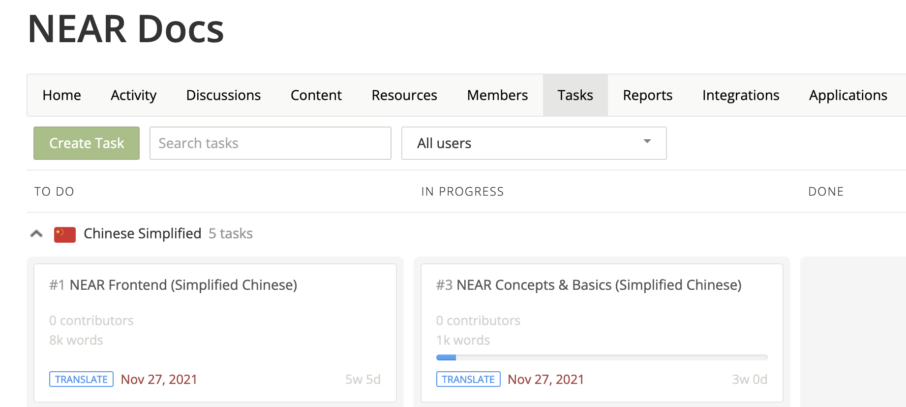
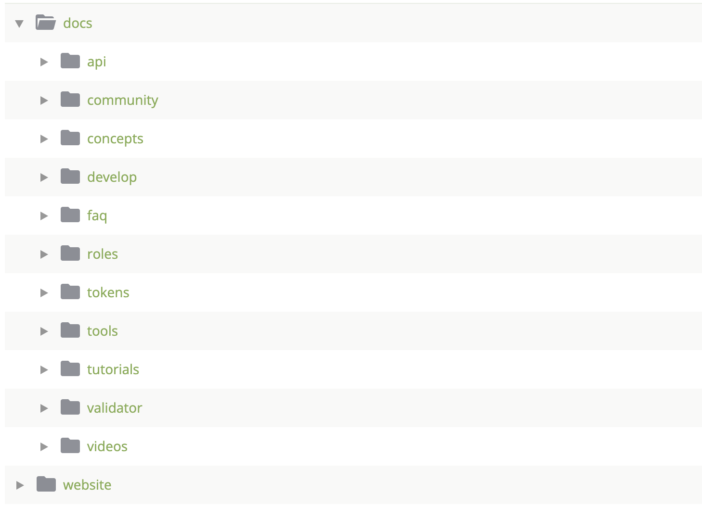

# Docs Localization

## Introduction

Welcome to the [NEAR Dev Docs](https://docs.near.org/) translation project.
This article is aimed to community members that want to help in the localization of NEAR's documentation.
If you feel comfortable translating from English into your local language, you're more than welcome to contribute with this project.

### Roles

For simplicity, the translation project is hosted on [Crowdin](https://crowdin.com/project/near-docs) and anyone is free to register and join.
There are 3 basic roles across the Crowdin project:

1. **Translator:** translates documentation
2. **Proof Reader:** helps proof reading localized documents
3. **Manager:** manages memberships and helps with technical issues

### How to become a Translator

To become a certified NEAR docs translator, you need to pass a pre-translation test by working on a selected document translation. A proof reader will review your document, and if your translation proves to be high-quality, your application will be accepted and you'll be accepted as a NEAR Certified Translator.

> To become a certified translator, please join our [Crowdin project](https://crowdin.com/project/near-docs) and [create a new topic](https://crowdin.com/project/near-docs/discussions) with your application.
> The NEAR team will review your request, assign a test, and follow up with you as needed.
>
> If you have questions, please contact us on [Discord](https://near.chat). 

## How to translate

Before you start working on the translation of an article, you need to get pre-approval from the community first. The reason is to make sure the plans are transparent in the community, and the proof-readers can help to review and approve the translation once it's ready.

You can check the current translation plans available for each language on the [Tasks section](https://crowdin.com/project/near-docs/tasks):

If there's no active plan for your language, you can submit a proposal by opening a thread on the [Discussions section](https://crowdin.com/project/near-docs/discussions).
Once your plan is pre-approved by the community, you can just go to the [Crowdin project](https://crwd.in/near-docs) and work on the translation of the specific markdown file.

### Translation plan

For each language, the current plan is to translate all the documents with the following priorities.

**Website**

1. `website` (except the `docusaurus-plugin-content-blog` folder)

**Developer**

1. `concepts`
2. `develop`
3. `tutorials`
4. `tools`
5. `api`
6. `intergrator`

**Exchanges & Integration**

1. `roles`
2. `faq`

### Proof reading and go-to Production

For each document, expect no less than two proof readers to review the translations. The translator or proof reader can propose different translations if he/she doesn't agree the existing ones, the translations that receive the most votes will be accepted and displayed in the production version.

> Please pay attention to the maintainer's feedback, since its a necessary step to keep up with the standards NEAR attains to.

## Questions?

If you have any questions feel free to post them to our [Discord channel](http://near.chat).

Thanks for your time and translations!

> Got a question? [Ask it on StackOverflow!](https://stackoverflow.com/questions/tagged/nearprotocol)
