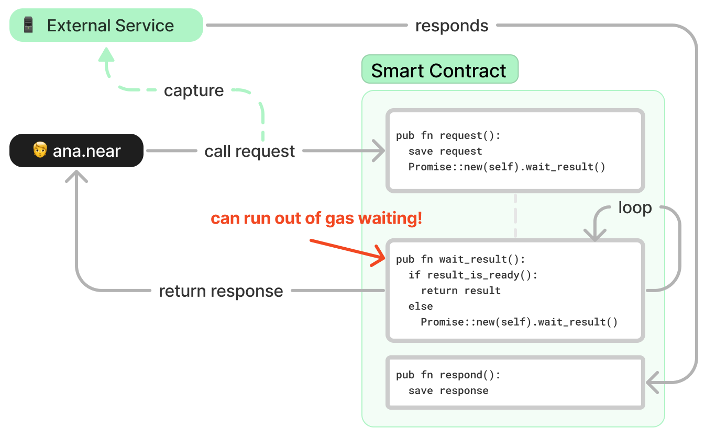
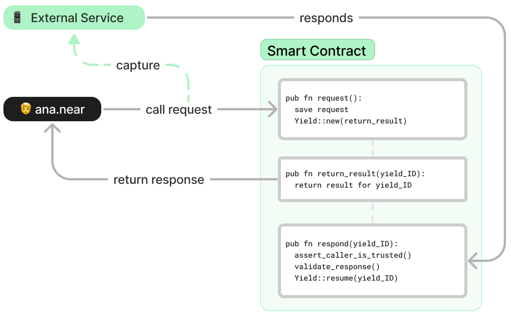

*dary! Legendary! NEAR protocol is getting updated with the ability to yield and resume computations*


<!-- truncate -->

## Waiting on a Loop
Currently, smart contracts have no way to wait the completion of an external process. This is, for example, the case for our [Chain Signatures](/concepts/abstraction/chain-signatures), they work by requiring an external service to provide a signature.

So far, workaround for this has been to make the contract call itself on a loop, checking on each iteration if the result is ready.

This works because each call on itself delays the result by one block (~1 second), which gives the contract about a minute of waiting before it runs out of gas.


*Until now, contracts had to wait by calling themselves until a external service replies... more often than not the contract will run out of gas waiting*

While this method works, it is not ideal. It wastes a lot of gas on waiting, and more often than not, it will run out of gas, forcing the user to retry the transaction.

## Yield and Resume
Starting from `v1.40` of `nearcore` developers will be able to **delay executing** a [callback function](/build/smart-contracts/anatomy/crosscontract#callback-method) until an external agent signals that it is ok to resume computation.

Instead of the contract calling itself on a loop, the contract can now **yield** the a function call, which will only execute after a **resume** is called.


*Contracts can now yield the execution of a function until an external service signals that the result is ready*

Between the `yield` and `resume` the user will simply be waiting to get the result. The maximum time to wait is 500 blocks - around 10 minutes - before the protocol kills the `yield`. This however is much larger than what `300Tgas` can get you while looping.

## What is exactly being yielded?
It is important to notice that the contract is not **halting itself**, or **halting in the middle of a computation**. Instead, the contract is simply **delaying the execution of a callback** until an external agent signals that it is ok to resume.

:::danger
Just as with callbacks in cross-contract calls, people can keep calling functions con the contract between the `yield` and the `resume`, meaning that the state **can change**.

Moreover, since the function used to signal is public, developers must make sure to guard it properly to avoid unwanted calls. This can be done by simply checking the caller of the function.
:::

## How I can use yield/resume in my contract?
`yield` and `resume` do not currently have a simple way to be used in Rust smart contract. However, there is a working example you can look at from [Saketh Are](https://github.com/near/near-sdk-rs/pull/1133/files)

The basic idea is that two functions will be exposed:
- A `yield(function_to_yield)` that will return a `yield_ID` to identified the yield
- A `resume(yield_ID, result)` that signals which instance of `function_to_yield` can continue

Here is a simplified version, for a contract that request weather information for a city using an external service:

```rust
// const DATA_ID_REGISTER: u64 = 0;

pub fn request_weather(&mut self, city: String) {
    let index = self.next_available_request_index;
    self.next_available_request_index += 1;

    let yield_promise = env::promise_yield_create(
        "return_result",
        &serde_json::to_vec(&(index,)).unwrap(),
        SIGN_ON_FINISH_CALL_GAS,
        GasWeight(0),
        DATA_ID_REGISTER,
    );

    // Store the request, that an external service will fetch
    let data_id: CryptoHash =
        env::read_register(DATA_ID_REGISTER).expect("").try_into().expect("");
    self.requests.insert(&index, WeatherRequest{&data_id, &city});

    // The return for this function will be the return of "return_value"
    env::promise_return(yield_promise);
}

/// Called by external participants to submit a signature
pub fn respond(&mut self, data_id: String, signature: String) {
    let mut data_id_buf = [0u8; 32];
    hex::decode_to_slice(data_id, &mut data_id_buf).expect("");
    let data_id = data_id_buf;

    // check that caller is allowed to respond, signature is valid, etc.
    // ...

    log!("submitting response {} for data id {:?}", &signature, &data_id);
    env::promise_yield_resume(&data_id, &serde_json::to_vec(&signature).unwrap());
}

/// Callback receiving the externally submitted data (or a PromiseError)
pub fn return_value(
    &mut self,
    request_index: u64,
    #[callback_result] temperature: Result<i32, PromiseError>,
) -> String {
    // Clean up the local state
    self.requests.remove(&request_index);

    match temperature {
        Ok(temperature) => "temperature received: ".to_owned() + &signature,
        Err(_) => "request timed out".to_string(),
    }
}
```

We expect to have a more user-friendly way to use `yield` and `resume` in the future, so stay tuned!