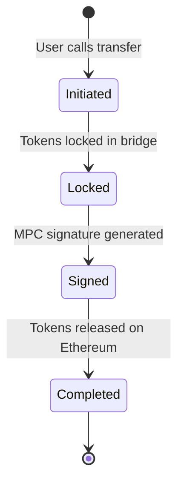
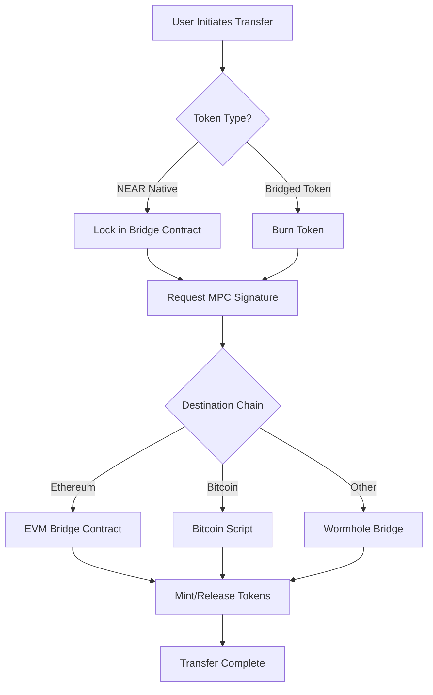

The Omni Bridge is a sophisticated cross-chain bridge infrastructure that enables secure and efficient token transfers between NEAR Protocol and various other blockchain networks. This document provides a detailed technical overview of the bridge's architecture, covering its core components, security model, and operational mechanisms. By leveraging a combination of Multi-Party Computation (MPC), chain-specific light clients, and a permissionless relayer network, the bridge achieves a robust balance of security, decentralization, and user experience.

## The Bridge Token Factory Pattern

At the core of Omni Bridge is the Bridge Token Factory contract on NEAR that serves as both a token factory and custodian. This unified contract handles both native tokens from the source chain and bridged tokens created by the factory itself. This design simplifies maintenance and reduces complexity compared to having separate contracts.

The contract has several key responsibilities:

### For bridged tokens (tokens originally from other chains):

* Deploys new token contracts when bridging tokens for the first time
* Mints tokens when receiving valid transfer messages
* Burns tokens when initiating transfers back to the origin chain

### For native NEAR tokens:

* Acts as a custodian by locking tokens during transfers
* Releases tokens when receiving valid transfer messages
* Manages token operations through the NEP-141 standard

### Transfer Lifecycle

A transfer's lifecycle includes several states, shown below for a NEAR to Ethereum transfer of native NEAR tokens:

---

## Message Signing and Verification

For most chains, the bridge uses a payload-based message signing system (with Bitcoin being a notable exception requiring full transaction signing).

### Message Types

The bridge supports several types of signed messages:

* **Transfer Messages**
  * Initiation messages
  * Finalization messages
* **Token Messages**
  * Deployment messages
  * Metadata update messages

### Payload Structure

Messages are encoded using Borsh serialization and contain:

| Component | Description |
|-----------|-------------|
| Message Type | Identifier for the message category |
| Chain Info | Chain IDs and relevant addresses |
| Operation Data | Amounts, recipients, fees, etc. |

### Signature Process

1. NEAR contract creates and stores the message payload
2. MPC network observers detect valid payloads
3. Nodes jointly sign the payload
4. Signature is verified on destination chains

:::tip Key Benefits
* Clearer message intent through structured payloads
* More efficient signature verification on destination chains
* Standardized message format across chains
:::

## Transaction Flow: NEAR to Other Chains

Here's an overview of how transfers are processed from NEAR to different destination chains:

### Transfer Process

Let's follow what happens when a user wants to transfer tokens from NEAR to another chain:

#### 1. Initiation

The user starts by calling the token contract with:

* Amount to transfer
* Destination chain and address
* Fee preferences (whether to pay fees in the token being transferred or in NEAR)

#### 2. Token Lock

The token contract transfers tokens to the locker contract, which:

* Validates the transfer message
* Assigns a unique nonce
* Records the pending transfer
* Emits a transfer event

#### 3. MPC Signing

The bridge contract:

* Requests signature generation
* MPC nodes jointly generate and aggregate signature
* Maintains threshold security throughout process

#### 4. Destination Chain

The Bridge Token Factory on the destination chain:

* Verifies the MPC signature
* Mints equivalent tokens
* Fees are minted on NEAR side for relayers

---

## Transaction Flow: Other Chains to NEAR

The reverse flow varies based on the source chain:

### 1. Ethereum

Uses NEAR light client for maximum security:

* Burning tokens on source chain
* Submitting proof to NEAR
* Verifying proof through light client
* Releasing tokens to recipient

### 2. Solana

Currently using Wormhole for:

* Message passing between chains
* Transaction verification
* Integration with NEAR token factory system

### 3. Other Chains

Initially using Wormhole for:

* Message passing between chains
* Transaction verification
* Will transition to Chain Signatures

---

## Security Model

### Trust Assumptions

Omni Bridge requires different trust assumptions depending on the chain connection:

#### For Chain Signatures:

* NEAR Protocol security (2/3+ honest validators)
* MPC network security (2/3+ honest nodes)
* No single entity controls enough MPC nodes to forge signatures
* Correct implementation of the signing protocol

#### For Ethereum/Bitcoin connections:

* Light client security
* Finality assumptions (e.g., sufficient block confirmations)
* Chain-specific consensus assumptions

#### For interim Wormhole connections:

* Wormhole Guardian network security
* We acknowledge this is a temporary trust assumption until Chain Signatures integration is complete

---

## Relayer Network

Relayers are permissionless infrastructure operators who monitor for bridge events and execute cross-chain transactions. Unlike many bridge designs, our relayers cannot:

* Forge transfers
* Steal funds
* Censor transactions (users can self-relay)
* Front-run transactions for profit

:::info
The relayer's role is purely operational - executing valid transfers and collecting predetermined fees. Multiple relayers can operate simultaneously, creating competition for faster execution and lower fees.
:::

---

## Fee Structure

Bridge fees are unified and processed on NEAR, with components including:

### Execution Fees

* Destination chain gas costs
* Source chain storage costs
* Relayer operational costs
* MPC signing costs

### Fee Payment Options

* Native tokens of source chain
* The token being transferred 

:::note
Fees dynamically adjust based on gas prices across different chains to ensure reliable execution.
:::

### Design Goals

The fee structure is designed to:

* Ensure relayer economic viability
* Prevent economic attacks
* Allow fee market competition
* Cover worst-case execution costs

:::tip
Users can bypass relayers entirely by executing their own transfers, paying only the necessary gas fees on each chain. This creates a natural ceiling on relayer fees.
:::

