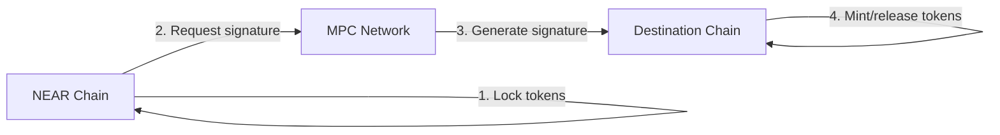

The [Omni Bridge](https://github.com/Near-One/omni-bridge) is a trustless multi-chain bridge that combines [Chain Signatures](../chain-signatures.md) for cross-chain transaction execution with a verification layer allowing NEAR smart contracts to confirm transactions on foreign chains. This creates a fully trustless system where NEAR can both initiate and verify cross-chain operations, effectively positioning NEAR as a settlement layer for cross-chain transactions.

Unlike traditional bridges that rely on light clients for cross-chain verification (which can be computationally expensive and slow), Omni Bridge uses NEAR's Chain Signatures - a multi-party computation (MPC) system that enables secure cross-chain message verification without the computational overhead of light client verification. This approach reduces verification times from hours to minutes and significantly reduces gas costs across all supported chains.

## Key Features

- **Simple API:** Developers can integrate cross-chain capabilities into their applications with straightforward method calls
- **Event Listening:** - Capable of listening for blockchain events, which aids in tracking the status of asset transfers
- **Support for Multiple Tokens:** The SDK is equipped to handle various tokens, making it versatile for different use cases
- **Fast Transaction Processing:**  Reduces cross-chain verification times from hours to minutes compared to traditional light client approaches
- **Gas Efficient:** - Significantly lower gas costs across supported chains due to the Chain Signatures verification system

## Architecture

The Omni Bridge consists of three core components:

1. **Chain Signatures**:
   - Omni Bridge uses [Chain Signatures](../chain-signatures.md) to derviive chain-specific address & sign messages
   - Every NEAR account can mathematically derive nearly infinate addresses on other chains through derivation paths
   - Ensures the same NEAR account always controls the same set of addresses across all supported chains

2. **Bridge Smart Contract**:
   - Coordinates with the MPC network to generate secure signatures
   - Handles token locking and requesting signatures for outbound transfers
   - Implements the Bridge Token Factory pattern for managing both native and bridged tokens

3. **MPC Service**:
   - Decentralized network of nodes that jointly sign transactions
   - No single node can create valid signatures alone
   - Uses threshold cryptography for security
   - Eliminates need for challenge periods through MPC threshold guarantees

## Supported Chains

Currently supported chains with their verification methods:

- Ethereum (Light client + Chain Signatures)
- Bitcoin (Light client + Chain Signatures)
- Solana (Currently Wormhole, transitioning to Chain Signatures)
- Base (Currently Wormhole, transitioning to Chain Signatures)
- Arbitrum (Currently Wormhole, transitioning to Chain Signatures)

## Use Cases

- **Cross-Chain Token Transfers:** Enable fast, secure token movements between supported chains
- **Bridge Token Factory:** Deploy and manage bridged token contracts automatically
- **Native Token Management:** Lock and release native tokens during cross-chain transfers
- **Cross-Chain Contract Calls:** (Coming soon) Enable complex interactions between contracts on different chains

## Learn more

Proceed to the [Omni Bridge Deep Dive](omni-deep.md) to get a deeper understanding of how Omni Bridge works. We also recommend checking these GitHub repositories:

- [Near-One/omni-bridge](https://github.com/Near-One/omni-bridge) - Omni Bridge repository
- [Near-One/bridge-sdk-js](https://github.com/Near-One/bridge-sdk-js) - JavaScript SDK
- [Near-One/bridge-sdk-rs](https://github.com/Near-One/bridge-sdk-rs) - Rust SDK
