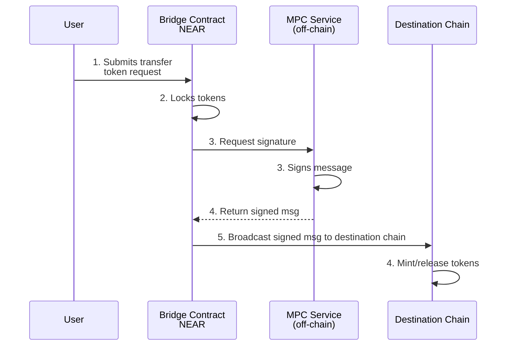

The [Omni Bridge](https://github.com/Near-One/omni-bridge) is a multi-chain bridge that represents a significant advancement in cross-chain communication. Traditional bridge implementations often rely on computationally expensive light clients, leading to high gas costs and long verification times. Omni Bridge takes a different approach by leveraging [Chain Signatures](../chain-signatures.md) and its decentralized [Multi-Party Computation (MPC) Service](../chain-signatures#multi-party-computation-service) to create a fully trustless system where NEAR can both initiate and verify cross-chain operations securely. This innovative architecture enables efficient asset transfers between blockchain networks while dramatically reducing verification times and lowering gas costs across all supported chains.

## Background

The journey toward truly trustless cross-chain communication took a significant leap forward when the NEAR team [created the first trustless bridge with Ethereum](https://near.org/blog/the-rainbow-bridge-is-live) (Rainbow Bridge). This pioneering achievement demonstrated that completely trustless cross-chain communication was possible, marking a crucial step toward the vision of chain abstraction. However, this approach relied on implementing a NEAR light client directly on Ethereum - essentially requiring Ethereum to understand and verify NEAR's complex blockchain rules. While secure, this approach faced several significant technical challenges that led to high gas costs and long verification times. For example, with Rainbow Bridge, transactions from NEAR to Ethereum take between 4 and 8 hours due to the 4-hour challenge period and block submission intervals driven by Ethereum's high gas costs.

More importantly, this approach becomes increasingly impractical when connecting to multiple chains, as each chain would require its own light client implementation. Some chains, such as Bitcoin, don't even support smart contracts, making it technically infeasible to implement a NEAR light client. While we still need to support light clients of different networks on NEAR (which is significantly easier to implement), a different approach is needed for verifying NEAR state on foreign chains.

Omni Bridge introduces a more elegant solution using Chain Signatures. Instead of running light clients on each destination chain, it leverages Chain Signature's MPC Service to enable secure cross-chain message verification without the overhead of light client verification. This new approach reduces verification times from hours to minutes while significantly reducing gas costs across all supported chains.

## How it works

The Omni Bridge consists of two core components:

1. [**Chain Signatures**](../chain-signatures.md):
   - Omni Bridge uses to dervive chain-specific address & sign messages
   - Every NEAR account can mathematically derive nearly infinate addresses on other chains through derivation paths
   - Ensures the same NEAR account always controls the same set of addresses across all supported chains
   - Uses a decentralized [MPC Service](../chain-signatures#multi-party-computation-service) to jointly sign messages
   - MPC threshold guarantees eliminate the need for challenge periods

2. [**Bridge Smart Contract**](https://github.com/Near-One/omni-bridge):
   - Coordinates with the MPC network to generate secure signatures
   - Handles token locking and requesting signatures for outbound transfers
   - Implements the Bridge Token Factory pattern for managing both native and bridged tokens
   - Coordinates token locking and signature requests in a single transaction
   - Leverages NEP-141's transfer-and-call functionality for single tran
   - Implements the Bridge Token Factory pattern for managing tokens
   - Records transfer state and initiates MPC signature requests

## Supported Chains

Currently supported chains with their verification methods:

- Ethereum (Light client + Chain Signatures)
- Bitcoin (Light client + Chain Signatures)
- Solana (Currently Wormhole, transitioning to Chain Signatures)
- Base (Currently Wormhole, transitioning to Chain Signatures)
- Arbitrum (Currently Wormhole, transitioning to Chain Signatures)

## Use Cases

- **Cross-Chain Token Transfers:** Enable fast, secure token movements between supported chains
- **Bridge Token Factory:** Deploy and manage bridged token contracts automatically
- **Native Token Management:** Lock and release native tokens during cross-chain transfers
- **Cross-Chain Contract Calls:** (Coming soon) Enable complex interactions between contracts on different chains

## Learn more

Proceed to the [Omni Bridge Deep Dive](omni-deep.md) to get a deeper understanding of how Omni Bridge works. We also recommend checking these GitHub repositories:

- [Near-One/omni-bridge](https://github.com/Near-One/omni-bridge) - Omni Bridge repository
- [Near-One/bridge-sdk-js](https://github.com/Near-One/bridge-sdk-js) - JavaScript SDK
- [Near-One/bridge-sdk-rs](https://github.com/Near-One/bridge-sdk-rs) - Rust SDK
