In NEAR, an `intent` is a high level declaration of what a user wants to achieve. Users or AI agents express their desired outcome (like "swap Token A for Token B at the best price") without needing to specify technical implementation details. 

[NEAR Intents](https://near.org/blog/introducing-near-intents/) is a new transaction framework that revolutionizes how users, services, and AI agents interact with blockchain networks. Instead of executing complex transactions directly across multiple chains, users simply declare what they want to achieve, and a network of solvers (both AI agents and traditional market participants) determines how to make it happen optimally.

:::info
The NEAR intents protocol and the documentation are under active development.

The protocol has been renamed from _Defuse_ to **NEAR Intents**.
Any mentions of _Defuse_ in the source code and documentation are to be replaced.
:::

## How It Works

There are four main components that work together to fulfill intent requests:

- [**Intent Creators**:](#intents) Users/Agents that create requestsfor a desired outcome.
- [**Solvers**:](#solvers) A decentralized network of solvers compete to fulfill request in the most optimal way.
- [**NEAR Smart Contract**:](#near-intent-smart-contract) A smart contract on NEAR facilitates the settlement of an intent on-chain.
- [**Bridge**:](#bridge) Enables communication between NEAR and other blockchain platforms.

Here's how these components work together:

1. [**Intent Creation**:](#intent) A user expresses a desired outcome (ex: Swap Token A for Token B).

2. [**Solvers Compete**:](#solvers-compete) The decentralized network of solvers competes to fulfill the request.

3. [**User Receives Quote**:](#user-receives-quote) The Solver Network selects the best quote and presents it to the user/agent.

4. [**Intent Execution**:](#intent-execution) When approved, solver initiates intent execution via the NEAR Intent Smart Contract.

5. [**Intent Settlement**:](#intent-settlement) NEAR contract and Bridge settle the intent across chains and verify state changes.

```mermaid
sequenceDiagram
    participant User/Agent
    participant Solver Network
    participant NEAR Blockchain
    participant Destination Chain

    User/Agent->>Solver Network: Broadcasts intent
    Solver Network-->>User/Agent: Return quote from a solver
    User/Agent->>Solver Network: User accepts quote and <br> solver executes intent
    Solver Network->>NEAR Blockchain: Solver calls NEAR <br> Intent smart contract
    note over NEAR Blockchain, Destination Chain: Bridge facilitates <br> cross chain communication
    NEAR Blockchain-->>Destination Chain: Transaction(s) broadcasted <br> to destination chain


    Destination Chain->>NEAR Blockchain: Transaction(s) completes
    note over NEAR Blockchain: NEAR smart contract <br> verifies and settles intent
    NEAR Blockchain->>User/Agent: 
    note right of User/Agent: Intent Fulfilled! ✅
```

## Terminology

1. Intent Settlement:
   1. [Solver Bus.](#solver-bus) an off chain message bus used for communication and sending `permits` between solvers and users. In general, specific only to a single distribution channel with solvers that may be authorized / trusted by this distribution channel. In the beginning of the project, a single shared solver bus may exist.
   2. [Verifier](#verifier). Smart contract that verifies intents expressed as state changes (`diffs`) signed by corresponding owners (a.k.a `permits`). The combination of state changes is committed as long as the invariant (total delta is zero) was kept for each token after these changes were applied. Deployed on NEAR `mainnet`.
2. Entities:
   1. Distribution channels. Applications that have the users, who are interested in decentralized spot trading.
   2. Solvers. Active market participants that fill in the intents issued by users.

## Verifier

Source code and deployment for the verifier smart contract.

:::tip Source code

You can find the source code of the verifier smart contract in [this GitHub repository](https://github.com/near/intents).

:::

### Deployment

The smart contract for NEAR Intents protocol is deployed at [`intents.near`](https://nearblocks.io/address/intents.near).

:::warning
Currently there is no `testnet` deployment.
:::

## Solver Bus

An off chain message bus used for communication and sending `permits` between solvers and users.

On the diagram "Solver Bus" is called "Solver Relay" and "Verifier" is part of NEAR Intents Smart contracts.

---

## Examples

Below are solver and frontend reference implementations for interacting with NEAR Intents protocol:

- [Defuse Frontend](https://github.com/defuse-protocol/defuse-frontend): `near-intents.org` website
- [Defuse SDK](https://github.com/defuse-protocol/defuse-sdk): Typescript SDK powering `near-intents.org`
- [AMM Solver](https://github.com/defuse-protocol/near-intents-amm-solver): Sample solver with AMM functionality
- [Python Client](https://github.com/referencedev/test-intent): A Python example of interacting with the Solver Bus
-