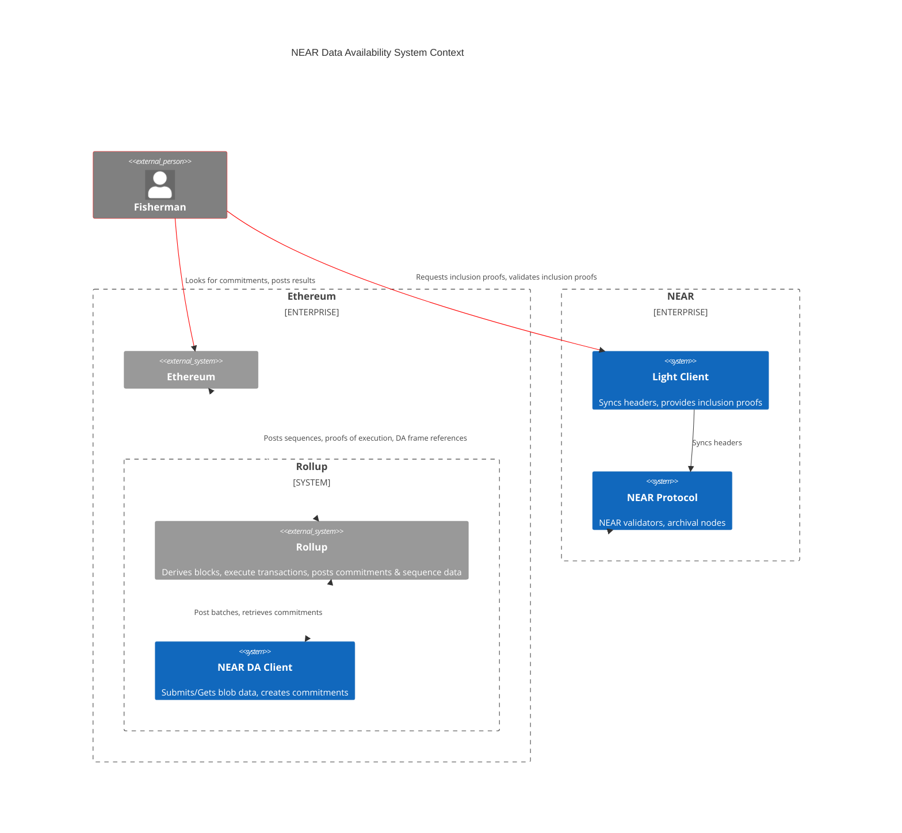

Every monolithic blockchain has a data availability layer. NEAR's Data Availability (DA) represents a pioneering initiative to modularize the data availability layer from the NEAR blockchain to make it available as a roll-up solution for builders on other chains. 

This infrastructure consists of a smart contract, a light client, and a Remote Procedure Call (RPC) node. The smart contract is designed to accept blob data, which is then processed through NEAR's consensus. The RPC node functions as the serving node, where users can transmit their data. Lastly, the light client operates as a node that rollups can verify to ensure the availability of data.

- [Blob Store Contract](#blob-store-contract): A contract that provides the store for arbitrary DA blobs.
- [Light Client](#light-client): A trustless off-chain light client for NEAR with DA-enabled features.
- [RPC Client](#da-rpc): The defacto client for submitting data blobs to NEAR.
- [Integrations](#integrations): Proof of concept works for integrating with L2 rollups.

NEAR DA is notably inexpensive due to several key factors:
- NEAR offers a substantial amount of block space per shard, ensuring efficient utilization.
- NEAR optimizes this space by avoiding unnecessary cryptographic bloat, ensuring that each 4MB allocated equals precisely 4MB of usable data.
- NEAR's scalability is unmatched, as it can readily reshard and scale in response to increasing demand, unlike competitors who would need to resort to constructing rollups or sidechains, thus maintaining a consistently ample and cost-effective data availability solution.

:::tip
For the latest information, please check the [Near DA](https://github.com/near/rollup-data-availability/) repository.
:::

---

## System Context

This outlines the system components that we build and how it interacts with external components.

Red lines denote external flow of commitments.
White lines denote flow of blob data.

:::note
`Fisherman` is just an example how a rollup can work with the light client in the initial stage of DA, until we implement a more non-interactive approach, such as KZG.
:::

---

## [Blob Store Contract](https://github.com/near/rollup-data-availability/tree/main/contracts/blob-store)

The [blob store contract](https://github.com/near/rollup-data-availability/tree/main/contracts/blob-store) provides the store for arbitrary DA blobs. In practice, these "blobs" are sequencing data from rollups, but they can be any data.

NEAR blockchain state storage is pretty cheap. At the time of writing, 100KiB is a flat fee of 1NEAR. To limit the costs of NEAR storage even more, we don't store the blob data in the blockchain state.

It works by taking advantage of NEAR consensus around receipts. When a chunk producer processes a receipt, there is consensus around the receipt. However, once the chunk has been processed and included in the block, the receipt is no longer required for consensus and can be pruned. The pruning time is at least 3 NEAR epochs, where each epoch is 12 Hours; in practice, this is around five epochs. Once the receipt has been pruned, it is the responsibility of archival nodes to retain the transaction data, and we can even get the data from indexers.

We can validate that the blob was retrieved from ecosystem actors in the format submitted by checking the blob commitment. The blob commitment currently needs to be more efficient and will be improved, but it benefits us because anybody can build this with limited expertise and tooling. It is created by taking a blob, chunking it into 256-byte pieces, and creating a Merkle tree, where each leaf is a Sha-256 hash of the shard. The root of the Merkle tree is the blob commitment, which is provided as [transaction_id ++ commitment] to the L1 contract, which is 64 bytes.

What this means:
- Consensus is provided around the submission of a blob by NEAR validators
- The function input data is stored by full nodes for at least three days
- Archival nodes can store the data for longer
- We don't occupy consensus with more data than needs to be
- Indexers can also be used, and this Data is currently indexed by all significant explorers in NEAR
- The commitment is available for a long time, and the commitment is straightforward to create

---

## [Light Client](https://github.com/near/rollup-data-availability/tree/main/)

A trustless off-chain light client for NEAR with DA-enabled features, Such as KZG commitments, Reed-Solomon erasure coding & storage connectors.

The light client provides easy access to transaction and receipt inclusion proofs within a block or chunk. This is useful for checking any dubious blobs which may not have been submitted or validating that a blob has been submitted to NEAR.

A blob submission can be verified by:

- Taking the NEAR transaction ID from Ethereum for the blob commitment.
- Ask the light client for an inclusion proof for the transaction ID or the receipt ID if you're feeling specific; this will give you a Merkle inclusion proof for the transaction/receipt.
- Once you have the inclusion proof, you can ask the light client to verify the proof for you, or advanced users can manually verify it themselves.
- Armed with this knowledge, rollup providers can have advanced integration with light clients and build proving systems around it.

In the future, we will provide extensions to light clients such that non-interactive proofs can be supplied for blob commitments and other data availability features.

It's also possible that the light client may be on-chain for the header syncing and inclusion proof verification, but this is a low priority right now.

---

## DA RPC
This client is the defacto client for submitting blobs to NEAR. These crates allow a client to interact with the blob store. It can be treated as a "black box", where blobs go in, and `[transaction_id ++ commitment]` emerges.

There are multiple versions:
- The [`da-rpc` crate](https://github.com/near/rollup-data-availability/tree/main/crates/da-rpc) is the rust client, which anyone can use if they prefer rust in their application.
The responsibility of this client is to provide a simple interface for interacting with NEAR DA.
- The [`da-rpc-sys` crate](https://github.com/near/rollup-data-availability/tree/main/crates/da-rpc-sys) is the FFI client binding for use by non-rust applications. This calls through to `da-rpc` to interact with the blob store, with some additional black box functionality for dealing with pointers wrangling and such.
- The [`da-rpc-go` package](https://github.com/near/rollup-data-availability/tree/main/gopkg/da-rpc) is the go client bindings for use by non-rust applications, and this calls through to `da-rpc-sys`, which provides another application-level layer for easy interaction with the bindings.

:::info
See also [the diagram](https://github.com/near/rollup-data-availability/blob/main/docs/da_rpc_client.md)
:::

---

## Integrations

We have developed some proof of concept works for integrating with L2 rollups:

- [CDK Stack](https://github.com/firatNEAR/cdk-validium-node/tree/near): We have integrated with the Polygon CDK stack. Using the Sequence Sender for submissions to NEAR.
- [Optimism](https://github.com/near/optimism): We have integrated with the Optimism OP stack. Using the `Batcher` for submissions to NEAR and the proposer for submitting NEAR commitment data to Ethereum.

- [Arbitrum Nitro](https://github.com/near/nitro): We have integrated a small plugin into the DAC daserver. This is much like our http sidecar and provides a very modular integration into NEAR DA whilst supporting arbitrum DACs.

:::info
In the future, the `Arbitrum Nitro` integration will likely be the easiest way to support NEAR DA as it acts as an independent sidecar which can be scaled as needed. This also means that the DAC can opt-in and out of NEAR DA, lowering their infrastructure burden. With this approach, the DAC committee members just need to have a "dumb" signing service, with the store backed by NEAR.
:::
