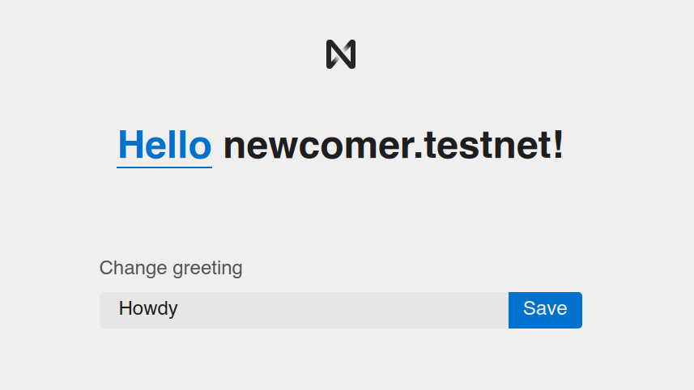

In this quickstart tutorial, we will take you through all the necessary steps to create your first decentralized application (dApp) in the NEAR platform. Particularly, you will create a hello world app and interact with it through a simple front end.

---

## Prerequisites
In order to successfully follow this quickstart guide you will need Node.js and RUST.

### 🚀 Node.js
Download and install [Node.js](https://nodejs.org/en/download/). Then, install `yarn`: `npm install --global yarn`.

### 🦀 Rust and Wasm

Follow [these instructions](https://doc.rust-lang.org/book/ch01-01-installation.html) for setting up Rust. Then, add the `wasm32-unknown-unknown` toolchain which enables compiling Rust to [Web Assembly (wasm)](https://webassembly.org/), the low-level language used by the NEAR platform.

#### Linux and MacOS:

```bash
# Get rust
curl --proto '=https' --tlsv1.2 https://sh.rustup.rs -sSf | sh
source $HOME/.cargo/env

# Add the wasm toolchain
rustup target add wasm32-unknown-unknown
```

---

## 👋 Hello NEAR!

Lets create your first decentralized app using NEAR, for this you will need just one command.
Using [npm's npx](https://blog.npmjs.org/post/162869356040/introducing-npx-an-npm-package-runner):

    npx create-near-app [options] hello-near

**or**, if you prefer [yarn](https://classic.yarnpkg.com/en/docs/cli/create/):

    yarn create near-app [options] hello-near

Without any options, this will create a project with a **vanilla JavaScript** frontend and an AssemblyScript smart contract. If you prefer, you can create a **React** frontend or a **Rust** smart contract you can use these options:

* `--frontend=react` – use [React](https://reactjs.org/) for your frontend template
* `--contract=rust` – use [Rust](https://docs.near.org/docs/develop/contracts/rust/near-sdk-rs) for your smart contract

---

## Interacting With your dApp

Before we talk about the structure in the folder structure of your dApp, go ahead and try it!. For this, 
enter the directory and use `yarn` to start it.

```bash
cd hello-near
yarn dev
```

Your contract will then be **compiled** and **deployed** to an **account** in the `testnet` network. When done, a browser window should open with your dApp. Go ahead, sign in and play around a bit, once you get familiarized with the application come back.


*Frontend of your first decentralized app in NEAR*

---

## Structure of your dApp

Let's take a closer look to the structure of your `hello-near` dApp:

1. The frontend code lives in the `/src` folder. Note that `/src/index.html` loads `/src/index.js`, which deals with connecting to the contract.
2. The smart contract code is in the `/contract` folder. The content differs from RUST to Assemblyscript, so check the README there for more info.
3. The compiled smart contract can be found in `/out/main.wasm`.
4. The account's name in which the contract was deployed is in `/neardev/dev-account`.

---

## Testing

When writing smart contracts it is very important to test all methods exhaustively. In this
project you have two types of tests: unit and integration. Before digging in them,
go ahead and perform the tests present in the dApp through the command `yarn test`.

### Unit test

Unit tests check individual functions in the smart contract. They are written in the
same language as the smart contract is. For Assemblyscript, you will find the test in
`/contract/assembly/__tests__/main.spec.ts`. If your contract is in RUST you will
find the test in...

### Integration test

Integration tests are generally written in javascript. They automatically deploy a new
contract and execute methods on it. In this way, integration tests simulate interactions
from users in a realistic scenario. You will find the integration tests for `hello-near`
in `src/main.test.js` (NOTE: lets change this to tests).

:::tip
Check the Testing section for more ways of testing
:::

---

## Moving Forward
That's it with our Quickstart tutorial. Now you have a fully functional contract with a
minimal user interface and testing. Go ahead with the [Developing Smart Contract](broken)
section to know how to evolve your contract.

If you have any questions, do not hesitate in joining us on [Discord](broken). We regularly
host Office Hours, in which you can join our voice channel and ask questions.

Happy coding!