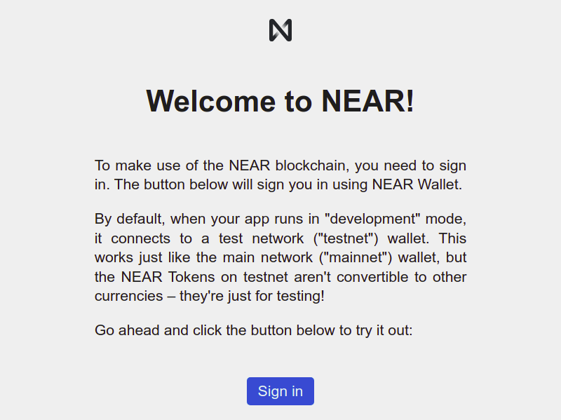

import Tabs from '@theme/Tabs';
import TabItem from '@theme/TabItem';
import {CodeTabs, Language, Github} from "@site/components/codetabs"

Welcome! Let us guide you in starting and interacting with your first decentralized app (dApp) in NEAR. **Hello NEAR!** is a friendly dApp composed by two main components:  
  1. A smart contract that stores and retrieves a greeting message
  2. A simple web-based frontend that displays the greeting and enables to change it.

---

## Starting Hello NEAR

You have two options to start Hello NEAR. The first and recommended is to use the app through Gitpod (a web-based interactive environment). The second option is to clone the repository locally, for which you will need to install all the [Prerequisites](../prerequisites.md).

<Tabs className="language-tabs" groupId="code-tabs">
  <TabItem value={0} label="🦀 - Rust">

| Gitpod | Clone locally |
  | --------------| ------ |
  |  <a href="https://gitpod.io/#https://github.com/near-examples/hello-near-rs.git"></a> | 🦀 ``` git clone https://github.com/near-examples/hello-near-rs.git ``` |

  </TabItem>

  <TabItem value={1} label="🚀 - AssemblyScript">

  | Gitpod | Clone locally |
  | --------------| ------ |
  | <a href="https://gitpod.io/#https://github.com/near-examples/hello-near-as.git"></a> | 🚀 ``` git clone https://github.com/near-examples/hello-near-as.git ```|


  </TabItem>
</Tabs>

If you choose Gitpod a new browser window will open automatically with the code, give it a minute and the frontend will pop-up (make sure the pop-up window is not blocked). If you are running the app locally, enter the directory where you cloned it and use `yarn` to install dependencies, and `yarn start` to start it.

```bash
cd hello-near
yarn
yarn start
```
Your contract will then be **compiled** and **deployed** to an **account** in the `testnet` network. When done, a browser window should open.


---

## Interacting With Hello NEAR


*Frontend of Hello NEAR*

Go ahead and login with your NEAR account. If you don't have one, you will be able to create one in the moment. Once logged in, change the greeting and see how our Hello NEAR app greets you!

---

## Structure of a dApp

Now that you understand what the dApp does, let us take a closer look to its structure:

1. The frontend code lives in the `/frontend` folder.
2. The smart contract code is in the `/contract` folder.
3. The compiled smart contract can be found in `/out/main.wasm`.
4. The account's name in which the contract was deployed is in `/neardev/dev-account`.

### Contract
The contract presents 2 methods: `set_greeting` and `get_greeting`. The first one stores a `String` in the contract's parameter `message`, while the second one retrieves it. By default, the contract returns the message `"Hello"`.

<CodeTabs>
  <Language value="🦀 - Rust" language="rust">
    <Github fname="lib.rs"
            url="https://github.com/near-examples/hello-near-rs/blob/main/contract/src/lib.rs"
            start="9" end="43" />
  </Language>
  <Language value="🚀 - AssemblyScript" language="ts">
    <Github fname="index.ts"
            url="https://github.com/near-examples/hello-near-as/blob/main/contract/assembly/index.ts"
            start="9" end="23"/>
  </Language>
</CodeTabs>

### Frontend
The frontend is composed by a single HTML file (`/index.html`). This file defines the components displayed in the screen.

The website's logic lives in `/assets/js/index.js`, which communicates with the contract through `/assets/js/near/utils.js`. You will notice in `/assets/js/index.js` the following code:

<CodeTabs>
  <Language value="🌐 - Javascript" language="js">
    <Github fname="index.js"
            url="https://github.com/near-examples/hello-near-rs/blob/main/frontend/assets/js/index.js"
            start="47" end="58" />
    <Github fname="utils.js"
            url="https://github.com/near-examples/hello-near-rs/blob/main/frontend/assets/js/near/utils.js"
            start="1" end="25" />
            
  </Language>
</CodeTabs>

It indicates our app, when it starts, to check if the user is already logged in and execute either `signedInFlow()` or `signedOutFlow()`.

---

## Testing

When writing smart contracts it is very important to test all methods exhaustively. In this
project you have two types of tests: unit and integration. Before digging in them,
go ahead and perform the tests present in the dApp through the command `yarn test`.

### Unit test

Unit tests check individual functions in the smart contract. They are written in the
same language as the smart contract is. For AssemblyScript, you will find the test in the 
`__tests__` folder. If your contract is in RUST you will find the tests at the bottom of
each `.rs` file.

<CodeTabs>
  <Language value="🦀 - Rust" language="rust">
    <Github fname="lib.rs"
            url="https://github.com/near-examples/hello-near-rs/blob/main/contract/src/lib.rs"
            start="53" end="71" />
  </Language>
  <Language value="🚀 - AssemblyScript" language="ts">
    <Github fname="main.spec.ts"
            url="https://github.com/near-examples/hello-near-as/blob/main/contract/assembly/__tests__/main.spec.ts" />
  </Language>
</CodeTabs>

### Integration test

Integration tests are generally written in javascript. They automatically deploy a new contract and execute methods on it. In this way, integration tests simulate interactions from users in a realistic scenario. You will find the integration tests for `hello-near` in `tests/main.test.js`.

<CodeTabs>
  <Language value="🌐 - Javascript" language="js">
    <Github fname="main.test.js"
            url="https://github.com/near-examples/hello-near-rs/blob/main/tests/main.test.js"
            start="16" end="26" />
  </Language>
</CodeTabs>

---

## Moving Forward

That's it for our first quickstart tutorial. You have now seen a fully functional contract with
a minimal user interface and testing. Go ahead and check the next example [Count on NEAR](./count-near.md)
or proceed straight to the [Develop section](../contracts/anatomy.md) to know how to write your own contract.

If you have any questions, do not hesitate in joining us on [Discord](https://near.chat). We regularly
host Office Hours, in which you can join our voice channel and ask questions.

Happy coding!
