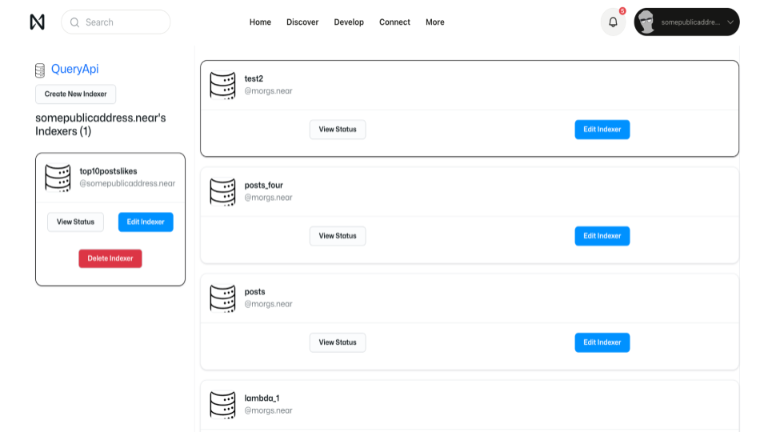
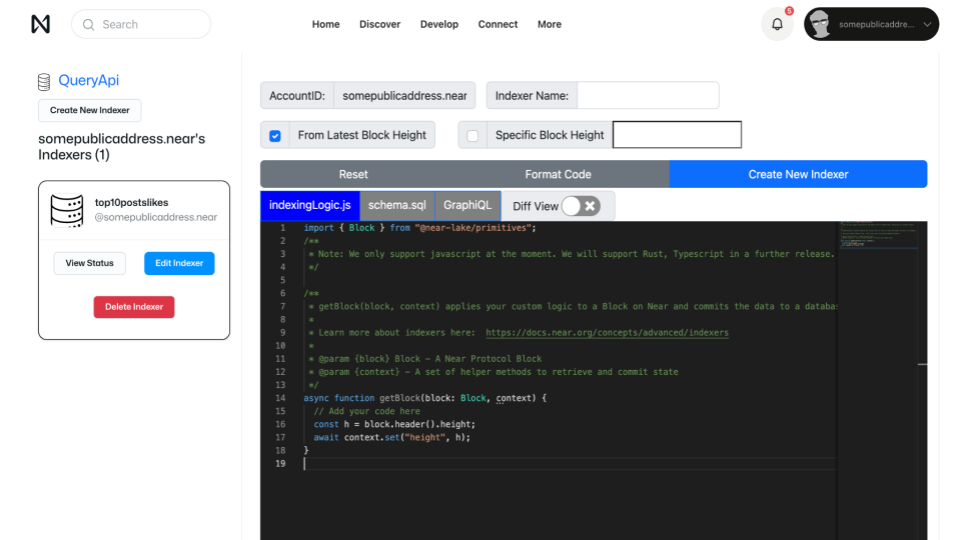

With QueryApi you can
* Write your own custom indexer function;
* Specify the schema for your own custom hosted database and write to it with your indexer function;
* Retrieve that data through a GraphQL API.
You can access the [NEAR QueryAPI by following this link](https://near.org/dataplatform.near/widget/QueryApi.Dashboard).

This should take you to a dashboard that looks like this:



## Creating an Indexer

Clicking on "Create New Indexer" will redirect you in-browser to a Component code editor that looks like this:



This is the interface through which you can create a new Indexer. On here you can specify:

* the filtering, transforming logic in `indexingLogic.js`
* the database schema in `schema.sql`
* the GraphQL queries in `GraphiQL`
* the indexer name on Indexer Name
* from which block to start indexing on Specific Block Height or From Latest Block Height (selected by default)

### `IndexingLogic.js`

The indexer code editor is pre-populated with a template that looks like this:

```js
import { Block } from "@near-lake/primitives";
/**
 * Note: We only support javascript at the moment. We will support Rust, Typescript in a further release.
 */

/**
 * getBlock(block, context) applies your custom logic to a Block on Near and commits the data to a database.
 *
 * Learn more about indexers here:  https://docs.near.org/concepts/advanced/indexers
 *
 * @param {block} Block - A Near Protocol Block
 * @param {context} - A set of helper methods to retrieve and commit state
 */
async function getBlock(block: Block, context) {
  // Add your code here
  const h = block.header().height;
  await context.set("height", h);
}
```

This editor with this code is part of the `indexingLogic.js` file that is selected. This logic in particular will perform the filtering of blockchain transactions, transforming and saving the data you specify to a GraphQL database you define in `schema.sql`.

### `schema.sql`

This tab in the editor will be pre-populated with a template that looks like this:

```sql
CREATE TABLE "indexer_storage" ("function_name" TEXT NOT NULL, "key_name" TEXT NOT NULL, "value" TEXT NOT NULL, PRIMARY KEY ("function_name", "key_name"))
```

This is the database schema that will be used to store the data you specify in `indexingLogic.js`. You can add more tables and columns to this schema as you see fit. They will be created as soon as you create the indexer.

### `GraphiQL`

The graphQL tab in the editor will allow you to view the returned data from the GraphQL database. This is best verified after you have created the indexer. You can also access a GraphQL Playground by visitng the "GraphQL Playground" link from the "View Status" page of the created indexer.
