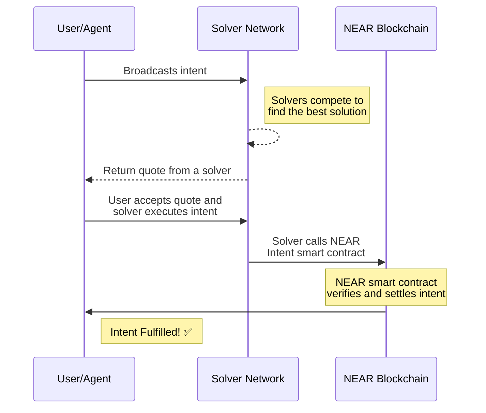

In NEAR, an `intent` is a high level declaration of what a user wants to achieve. Think of it as telling the blockchain "what" you want to do, not "how" to do it. For example, instead of manually:
- Finding the best DEX for a token swap
- Calculating optimal routes
- Executing multiple transactions

You simply express: "I want to swap Token A for Token B at the best price."

[NEAR Intents](https://near.org/blog/introducing-near-intents/) is a revolutionary transaction framework that simplifies blockchain interactions for:
- Users
- Services
- AI agents

The key innovation is that users & developers no longer need to handle complex cross-chain transactions themselves. Instead, they declare their desired outcome, and a specialized network of solvers (including both AI agents and traditional market participants) competes to execute that intent in the most optimal way possible.

:::info
The NEAR intents protocol and the documentation are under active development.

The protocol has been renamed from _Defuse_ to **NEAR Intents**.
Any mentions of _Defuse_ in the source code and documentation are to be replaced.
:::

## How It Works

1. [**Intent Creation**:](#intent-creation) A user or AI agent expresses a desired outcome _(ex: Swap Token A for Token B)_ and broadcasts the intent to a Solver Network of their choice.

2. [**Solvers Compete**:](#solvers) A off-chain decentralized network of solvers compete to fulfill the request in the most optimal way. When the solver network finds the best solution, it presents it as a quote to the originating user/agent for approval.

4. [**Intent Execution**:](#intent-execution) If the quote from the Solver Network is accepted, the intent begins execution. This is done by the solver performing a contract call (`execute_intents`) to the Intents smart contract on NEAR ([`intents.near`](https://nearblocks.io/address/intents.near)) and passing the intent details. This contract then fullfills the request and (if needed) uses a [cross-chain bridge](/concepts/intents/intents-bridge) to broadcast the intent to the destination chain. The NEAR Intent smart contract also verifies state changes and ensures the intent is settled correctly, reporting the outcome to the originating user/agent.

Here is a sequence diagram of the intent flow:



---

## Intent Creation

Users and AI agents can create various types of intents to interact with assets across different chains. Each intent represents a specific desired outcome while abstracting away the complexity of execution.

The main intent types supported by the `intents.near` contract are:

1. **Swap Intent**: Exchange one token for another at the best available rate
2. **Transfer Intent**: Move tokens between addresses or chains
3. **FT Withdraw Intent**: Withdraw fungible tokens from the protocol
4. **NFT Withdraw Intent**: Withdraw non-fungible tokens from the protocol
5. **MT Withdraw Intent**: Withdraw multiple tokens in a single transaction
6. **Native Withdraw Intent**: Withdraw native blockchain tokens (e.g., NEAR)

Each intent follows a standard structure that includes:
- The NEAR account ID of the initatior
- Type of intent they want to execute
- Source assets and amounts
- Desired outcome parameters
- Unique identifiers for tracking and authentication
- Optional constraints (e.g., minimum output amount, deadline)

Here is an example of a native NEAR swap intent structure ready to be broadcasted to a Solver Network:

```js
{
  intent_type: "atomic_near", // Type of intent - in this case for atomic swaps on NEAR
  intent_creation_hash: "Hx7b2270616...", // Unique hash of the intent for authenticity
  intent_id: "intent_1234567890", // Unique identifier for this specific intent
  intent_initiator: "alice.near", // The NEAR account ID of the user initiating the swap
  defuse_asset_identifier_in: "near:wrap.near",  // inpute token (what you are swapping)
  defuse_asset_identifier_out: "near:usdc.near", // output token (what you want to receive)
  amount_in: "1000000000000000000000000",  // Numbber of $NEAR in yoctoNEAR (1 NEAR = 10^24 yoctoNEAR)
  amount_out_desired: "1000000"            // Number of desired USDC (6 decimals)
}
```

<!-- TODO: add example of a cross-chain swap intent & and where to get the asset identifiers -->

---

## Solvers

NEAR Intents uses decentralized networks of solvers to fulfill intents. Each solver network is an off-chain message bus that facilitates:

1. Communication between users and solvers
2. Exchange of `permits` (signed state changes) between participants
3. Competition between solvers to provide the best quote possible for the intent originator

When an intent is broadcast, the solver network communicates with multiple solvers simultaneously. Each solver analyzes the intent and proposes their solution, including execution path and pricing. The solver network then aggregates these responses and selects the most optimal solution before presenting a final quote to the intent originator.

<!-- TODO: add diagram of the solver network -->

Solver networks are typically specific to a single distribution channel (like a DeFi application) and may contain authorized/trusted solvers for that channel. These solvers:

- Monitor for new intent broadcasts
- Calculate optimal execution paths
- Compete to provide the best quotes
- Execute approved intents through the NEAR smart contract
- Handle cross-chain coordination when needed

The decentralized nature of solver networks ensures:

- Competitive pricing through solver competition
- Redundancy and reliability
- Specialized solvers for different types of intents

:::tip
See [Create a Solver](/concepts/intents/solvers) for more details on how these solvers work.
:::
---

## Intent Execution

When a user accepts a quote from the Solver Network, the intent begins execution. This is done by the solver performing a contract call (`execute_intents`) to the Intents smart contract on NEAR ([`intents.near`](https://nearblocks.io/address/intents.near)) and passing the intent details. 

The NEAR Intents contract fullfills the request and (if needed) uses multi-chain bridge to settle an intent cross-chain. The Intent smart contract also verifies state changes and ensures the intent is settled correctly, reporting the outcome to the originating user/agent.

<!-- TODO: add link to smart contract docs -->

---

## Examples

Here are examples of NEAR Intents in action. Please note that this protocol is still under development and source code is available for learning purposes.

- [Defuse Frontend](https://github.com/defuse-protocol/defuse-frontend): `near-intents.org` fronted sourcecode
- [Defuse SDK](https://github.com/defuse-protocol/defuse-sdk): Typescript SDK powering `near-intents.org` [WIP]  
- [AMM Solver](https://github.com/defuse-protocol/near-intents-amm-solver): Sample solver with AMM functionality
- [Python Client](https://github.com/referencedev/test-intent): A Python example of interacting with the Solver Bus
- [NEAR Intents AI Agent Example](https://github.com/near-examples/near-intents-agent-example): A Python example of an AI agent that uses NEAR Intents

:::warning
Currently there is no `testnet` deployment.
:::