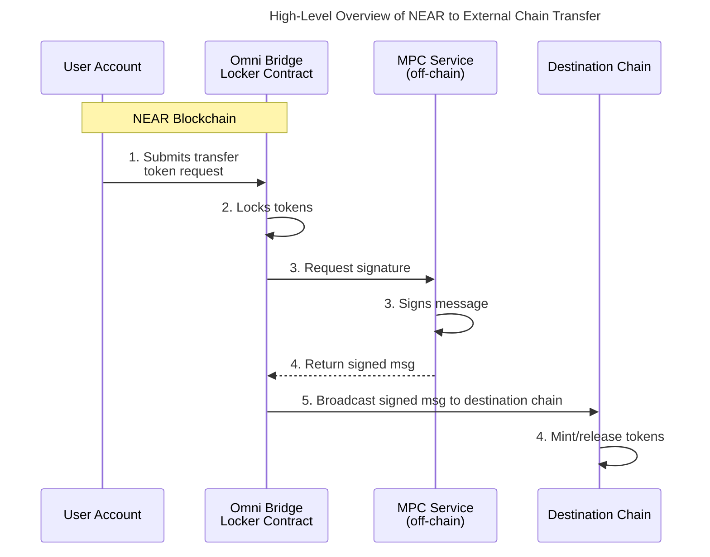

## Background

The journey toward truly trustless cross-chain communication took a significant leap forward when the NEAR team [created the first trustless bridge with Ethereum](https://near.org/blog/the-rainbow-bridge-is-live) (Rainbow Bridge). This pioneering achievement demonstrated that completely trustless cross-chain communication was possible, marking a crucial step toward the vision of chain abstraction. However, this approach relied on implementing a NEAR light client directly on Ethereum - essentially requiring Ethereum to understand and verify NEAR's complex blockchain rules. 

Omni Bridge introduces a more elegant solution using Chain Signatures. Instead of running light clients on each destination chain, it leverages Chain Signature's MPC Service to enable secure cross-chain message verification without the overhead of light client verification. This new approach reduces verification times from hours to minutes while significantly reducing gas costs across all supported chains.

### Issues with Light Clients

A light client is a smart contract that lets one blockchain verify events happening on another blockchain. In Rainbow Bridge's case, the Ethereum light client needs to track NEAR's blocks, verify its validators' signatures, and confirm transactions. This comes with major technical challenges: it requires storing two weeks of Ethereum block data, maintaining an updated list of NEAR validators and their stakes, and most crucially, verifying NEAR's ED25519 signatures - a process Ethereum wasn't built for. This verification is computationally expensive, making the whole process slow, costly, and ultimately a major bottleneck.

For example, with Rainbow Bridge, transactions from NEAR to Ethereum take between 4 and 8 hours due to the 4-hour challenge period and block submission intervals driven by Ethereum's high gas costs. More importantly, this approach becomes increasingly impractical when connecting to multiple chains, as each chain would require its own light client implementation. Some chains, such as Bitcoin, don't even support smart contracts, making it technically infeasible to implement a NEAR light client. 

While we still need to support light clients of different networks on NEAR (which is significantly easier to implement), a different approach is needed for verifying NEAR state on foreign chains.

### Token Standards and Cross-Chain Communication

Before exploring how Chain Signatures solves these issues, it's important to understand how tokens work on NEAR. [NEP-141](https://nomicon.io/Standards/Tokens/FungibleToken/Core), NEAR's fungible token standard, has a key feature that sets it apart from Ethereum's ERC-20: built-in composability through transfer-and-call functionality.

When a token transfer happens on NEAR using `ft_transfer_call`, the token contract first transfers the tokens and then automatically calls the specified `ft_on_transfer` method on the receiver contract. While these operations happen in sequence within the same transaction, the receiver contract has the ability to reject the transfer, causing the tokens to be refunded. This atomic behavior ensures the integrity and safety of bridge operations by preventing partial execution states.

For more information see [Fungible Tokens](../../../2.build/5.primitives/ft.md).

## Enter Chain Signatures

Instead of maintaining complex light clients on destination chains, Chain Signatures introduces a fundamentally different approach based on three core components:

1. **Deterministic Address Derivation** - Every NEAR account can mathematically derive addresses on other chains through derivation paths. This isn't just a mapping - it's a cryptographic derivation that ensures the same NEAR account always controls the same set of addresses across all supported chains.

2. **Bridge Smart Contract** - A central contract on NEAR coordinates with the MPC network to generate secure signatures for cross-chain transactions. This contract handles the token locking and requesting of signatures for outbound transfers

3. **MPC Service** - A decentralized network of nodes that jointly sign transactions without ever reconstructing a full private key. The security comes from threshold cryptography - no single node or small group of nodes can create valid signatures alone.

## Putting It All Together

As we've learned, Chain Signatures fundamentally changes the verification mechanism for cross-chain messages. Here's what this means in practice:

The light client approach requires destination chains to verify ED25519 signatures from NEAR validators. Chain Signatures replaces this with a single MPC signature verification. Destination chains only need to verify one signature using their native signature verification schemes - typically ECDSA for EVM chains.

NEP-141's transaction guarantees handle the security of token locking. A transfer creates two operations within a **single transaction**:
1. Lock tokens and record the transfer state
2. Request MPC signature for the destination chain

The Locker contract requests signatures from the MPC network, which then generates signatures for valid transfer requests. This replaces the need for challenge periods - the security derives from the MPC threshold guarantees rather than optimistic assumptions.

Adding new chains becomes a matter of implementing three standard components:
1. Chain-specific address derivation
2. MPC signature verification (or transaction signing for chains like Bitcoin)
3. Bridge contract deployment
4. Communication path for transfers back to NEAR (currently using Wormhole for newer chains)

While we still need light clients on NEAR for receiving transfers from other chains, this approach makes it feasible to support a wider range of chains without implementing complex verification logic on each destination chain.

