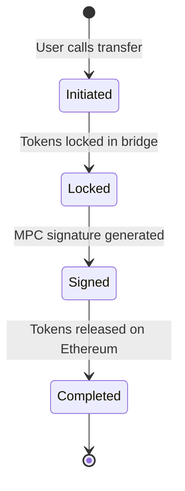
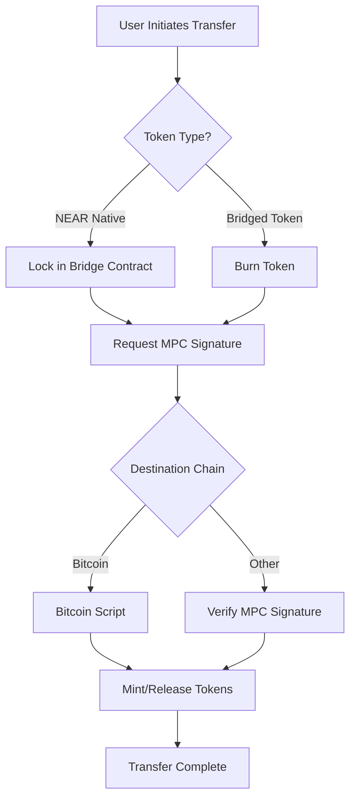

The Omni Bridge is a sophisticated cross-chain bridge infrastructure that enables secure and efficient token transfers between NEAR Protocol and various other blockchain networks. This document provides a detailed technical overview of the bridge's architecture, covering its core components, security model, and operational mechanisms. By leveraging a combination of Multi-Party Computation (MPC), chain-specific light clients, and a permissionless relayer network, the bridge achieves a robust balance of security, decentralization, and user experience.

For reference code implementations, see:

- [Bridge SDK JS](https://github.com/near-one/bridge-sdk-js) Omni Bridge implementation in JavaScript
- [Bridge SDK Rust](https://github.com/near-one/bridge-sdk-rs) Omni Bridge implementation in Rust

---

## The Bridge Token Factory Pattern

At the core of Omni Bridge is the Bridge Token Factory contract on NEAR that serves as both a token factory and custodian. This unified contract handles both native tokens from the source chain and bridged tokens created by the factory itself. This design simplifies maintenance and reduces complexity compared to having separate contracts.

The contract has several key responsibilities:

### For bridged tokens (tokens originally from other chains):

* Deploys new token contracts when bridging tokens for the first time
* Mints tokens when receiving valid transfer messages
* Burns tokens when initiating transfers back to the origin chain

### For native NEAR tokens:

* Acts as a custodian by locking tokens during transfers
* Releases tokens when receiving valid transfer messages
* Manages token operations through the NEP-141 standard

### Transfer Lifecycle

A transfer's lifecycle includes several states, shown below for a NEAR to Ethereum transfer of native NEAR tokens:

---

## Message Signing and Verification

For most chains, the bridge uses a payload-based message signing system (with Bitcoin being a notable exception requiring full transaction signing).

### Message Types

The bridge supports several types of signed messages:

* **Transfer Messages**
  * Initiation messages
  * Finalization messages
* **Token Messages**
  * Deployment messages
  * Metadata update messages

### Payload Structure

Messages are encoded using Borsh serialization and contain:

| Component | Description |
|-----------|-------------|
| Message Type | Identifier for the message category |
| Chain Info | Chain IDs and relevant addresses |
| Operation Data | Amounts, recipients, fees, etc. |

### Signature Process

1. NEAR contract creates and stores the message payload
2. MPC network observers detect valid payloads
3. Nodes jointly sign the payload
4. Signature is verified on destination chains

:::tip Key Benefits
* Clearer message intent through structured payloads
* More efficient signature verification on destination chains
* Standardized message format across chains
:::

## Transaction Flow: NEAR to Other Chains

Here's an overview of how transfers are processed from NEAR to different destination chains:

### Transfer Process

Let's follow what happens when a user wants to transfer tokens from NEAR to another chain:

#### 1. Initiation

The user starts by calling the token contract with:

* Amount to transfer
* Destination chain and address
* Fee preferences (whether to pay fees in the token being transferred or in NEAR)
* Fees are minted on NEAR side for relayers

#### 2. Token Lock

The token contract transfers tokens to the locker contract, which:

* Validates the transfer message
* Assigns a unique nonce
* Records the pending transfer
* Emits a transfer event

#### 3. MPC Signing

The bridge contract:

* Requests signature generation
* MPC nodes jointly generate and aggregate signature
* Maintains threshold security throughout process

#### 4. Destination Chain

The Bridge Token Factory on the destination chain:

* Verifies the MPC signature
* Mints equivalent tokens

---

## Transaction Flow: Other Chains to NEAR

The reverse flow varies based on the source chain:

### 1. Ethereum

Uses NEAR light client for maximum security:

* Burning tokens on source chain
* Submitting proof to NEAR
* Verifying proof through light client
* Releasing tokens to recipient

### 2. Supported Non-EVM Chains (e.g., Solana)

Utilize established message passing protocols (such as Wormhole) for:

* Message passing between chains
* Transaction verification
* Integration with NEAR token factory system

### 3. Other EVM Chains

Utilize a combination of light clients (where efficient) and message passing protocols to ensure secure verification of inbound transfers.

---

## Transaction Flow: Chain to Chain (via NEAR)

For transfers between two non-NEAR chains (e.g., Ethereum to Solana), the bridge combines both flows using NEAR as an intermediary routing layer. Rather than minting or unlocking tokens on NEAR, the bridge creates a forwarding message that directs tokens to be minted or unlocked on the final destination chain.

From the user's perspective, this appears as a single operation - they initiate the transfer on the source chain, and the off-chain relayer infrastructure handles the intermediate NEAR routing automatically.

---

## Security Model

### Trust Assumptions

Omni Bridge requires different trust assumptions depending on the chain connection:

#### For Chain Signatures:

* NEAR Protocol security (2/3+ honest validators)
* MPC network security (2/3+ honest nodes)
* No single entity controls enough MPC nodes to forge signatures
* Correct implementation of the signing protocol

#### For Ethereum/Bitcoin connections:

* Light client security
* Finality assumptions (e.g., sufficient block confirmations)
* Chain-specific consensus assumptions

#### For Message Passing connections:

* Security of the underlying message passing protocol (e.g., Wormhole Guardian network)
* Verified by the NEAR network consumers

---

## Relayer Network

Relayers are permissionless infrastructure operators who monitor for bridge events and execute cross-chain transactions. Unlike many bridge designs, our relayers cannot:

* Forge transfers
* Steal funds
* Censor transactions (users can self-relay)
* Front-run transactions for profit
* Do not create additional security assumptions

:::info
The relayer's role is purely operational - executing valid transfers and collecting predetermined fees. Multiple relayers can operate simultaneously, creating competition for faster execution and lower fees.
:::

---

## Fast Transfers

Standard cross-chain transfers can take time due to finality and verification requirements. **Fast Transfers** allow relayers to expedite this process by fronting liquidity.

### How it Works

1.  **User Initiation:** A user sends a `FastFinTransferMsg` specifying the destination and fee.
2.  **Relayer Execution:** A relayer detects the request and instantly transfers the equivalent amount (minus fees) to the user on the destination chain from their own funds.
3.  **Settlement:** The bridge later reimburses the relayer once the original transfer is fully verified and finalized.

:::tip
Fast transfers are ideal for users who prioritize speed over cost, as relayers may charge a premium for the liquidity and convenience.
:::

---

## Multi-Token Support (ERC1155)

Omni Bridge supports the **ERC1155** standard, enabling the transfer of multiple token types within a single contract.

### Address Derivation
To maintain consistency across chains, bridged ERC1155 tokens use a deterministic address derivation scheme:
*   **Deterministic Address:** `keccak256(tokenAddress + tokenId)`
*   This ensures that each `tokenId` within an ERC1155 contract maps to a unique, consistent address on the destination chain.

### Key Functions
*   **`initTransfer1155`**: Initiates a transfer for a specific ERC1155 token ID.
*   **`logMetadata1155`**: Registers metadata for a specific token ID, ensuring it is recognized by indexers and wallets.

---

## Fee Structure

Bridge fees are unified and processed on NEAR, with components including:

### Execution Fees

* Destination chain gas costs
* Source chain storage costs
* Relayer operational costs
* MPC signing costs

### Fee Payment Options

* Native tokens of source chain
* The token being transferred 

:::note
Fees dynamically adjust based on gas prices across different chains to ensure reliable execution.
:::

### Design Goals

The fee structure is designed to:

* Ensure relayer economic viability
* Prevent economic attacks
* Allow fee market competition
* Cover worst-case execution costs

:::tip
Users can bypass relayers entirely by executing their own transfers, paying only the necessary gas fees on each chain. This creates a natural ceiling on relayer fees.
:::

