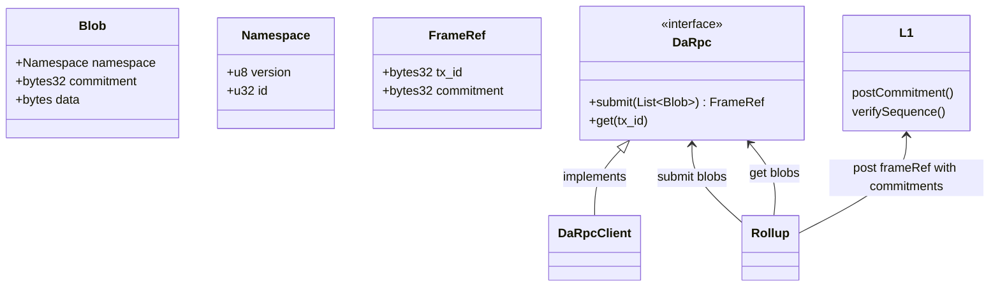
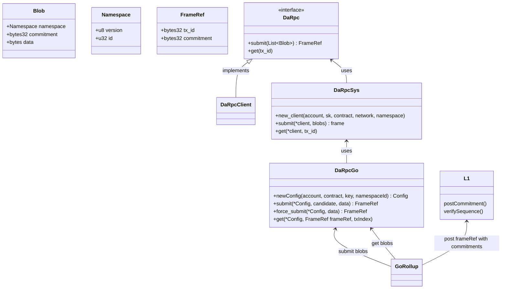

This client is the defacto client for submitting blobs to NEAR.
These crates allow a client to interact with the blob store.
It can be treated as a "black box", where blobs go in, and `[transaction_id ++ commitment]` emerges.

The `da-rpc` crate is the rust client, which anyone can use if they prefer rust in their application.
The responsibility of this client is to provide a simple interface for interacting with NEAR DA.

The `da-rpc-sys` crate is the FFI client binding for use by non-rust applications. This calls through to `da-rpc` to interact with the blob store, with some additional black box functionality for dealing with pointers wrangling and such.

The `da-rpc-go` crate is the go client bindings for use by non-rust applications, and this calls through to `da-rpc-sys`, which provides another application-level layer for easy interaction with the bindings.

---

# Diagram

The below diagrams outline how a rollup will interact with DA depending on their architecture.

## Rust

## Golang, or anything CFFI compatible

This diagram outlines how rollups written in golang would interact with the go rpc client.

