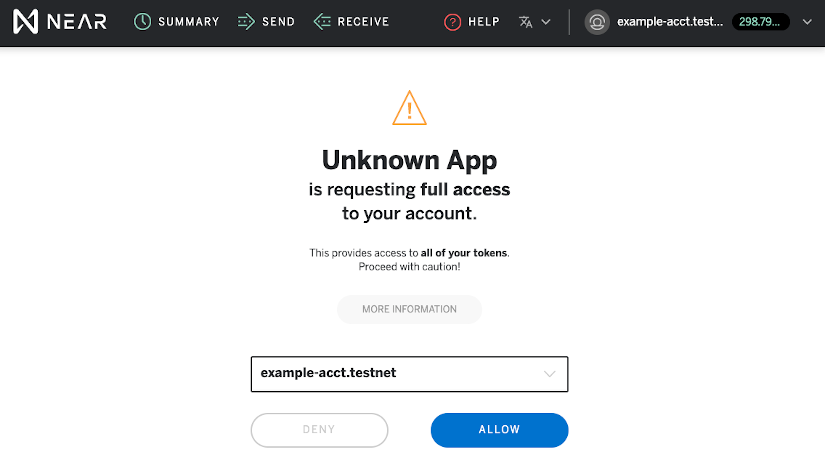
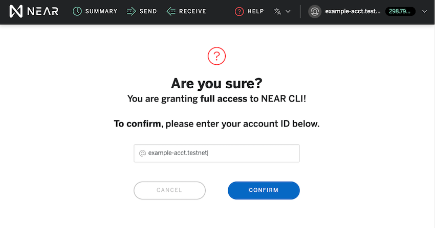

> [`near-cli`](https://github.com/near/near-cli) is a [NodeJS](https://nodejs.org/) command line interface that utilizes [`near-api-js`](https://github.com/near/near-api-js) to connect to and interact with the NEAR blockchain.

---

## Overview

_Click on a command for more information and examples._

**Access Keys**

| Command                                                             | Description                                                                                                       |
| ------------------------------------------------------------------- | ----------------------------------------------------------------------------------------------------------------- |
| [`near login`](/docs/development/near-cli#login)                    | stores a full access key locally using [NEAR Wallet](https://wallet.testnet.near.org/)                            |
| [`near keys`](/docs/development/near-cli#near-keys)                 | displays all access keys for a given account                                                                      |
| [`near generate-key`](/docs/development/near-cli#near-generate-key) | generates a local key pair **or** shows public key & [implicit account](/docs/roles/integrator/implicit-accounts) |
| [`near add-key`](/docs/development/near-cli#near-add-key)           | adds an access key to an account                                                                                  |

**Accounts**

| Command                                                            | Description                                                                 |
| ------------------------------------------------------------------ | --------------------------------------------------------------------------- |
| [`near create-account`](/docs/development/near-cli#create-account) | creates an account                                                          |
| [`near state`](/docs/development/near-cli#near-state)              | shows general details of an account                                         |
| [`near keys`](/docs/development/near-cli#near-keys)                | displays all access keys for a given account                                |
| [`near send`](/docs/development/near-cli#near-send)                | sends tokens from one account to another                                    |
| [`near delete`](/docs/development/near-cli#near-delete)            | deletes an account and transfers remaining balance to a beneficiary account |

**Contracts**

| Command                                                         | Description                                             |
| --------------------------------------------------------------- | ------------------------------------------------------- |
| [`near deploy`](/docs/development/near-cli#near-deploy)         | deploys a smart contract to NEAR                        |
| [`near dev-deploy`](/docs/development/near-cli#near-dev-deploy) | deploys a contract using a temp acct _(`testnet` only)_ |
| [`near call`](/docs/development/near-cli#near-call)             | makes a contract call which can modify _or_ view state  |
| [`near view`](/docs/development/near-cli#near-view)             | makes a contract call which can **only** view state     |

**Transactions**

| Command          | Description                             |
| ---------------- | --------------------------------------- |
| `near tx-status` | looks up a transaction's status by hash |

**Validators**

| Command           | Description                                   |
| ----------------- | --------------------------------------------- |
| `near validators` | views both current and next validator details |
| `near proposals`  | displays proposals for epoch after next       |

**Repl**

| Command     | Description                                               |
| ----------- | --------------------------------------------------------- |
| `near repl` | launches an interactive connection to the NEAR blockchain |

---

## Setup

### Installation

> Make sure you have a current version of `npm` and `NodeJS` installed.

#### Mac and Linux

1. Install `npm` [[ click here ]](https://www.npmjs.com/get-npm)
2. Install `NodeJS` [[ click here ]](https://nodejs.org/en/download)
3. Install `near-cli` globally by running:

```bash
npm install -g near-cli
```

#### Windows

> For Windows users, we recommend using Windows Subsystem for Linux (`WSL`).

1. Install `WSL` [[ click here ]](https://docs.microsoft.com/en-us/windows/wsl/install-manual#downloading-distros)
2. Install `npm` [[ click here ]](https://www.npmjs.com/get-npm)
3. Install ` Node.js` [ [ click here ]](https://nodejs.org/en/download/package-manager/)
4. Change `npm` default directory [ [ click here ] ](https://docs.npmjs.com/resolving-eacces-permissions-errors-when-installing-packages-globally#manually-change-npms-default-directory)
   - This is to avoid any permission issues with `WSL`
5. Open `WSL` and install `near-cli` globally by running:

```bash
npm install -g near-cli
```

<blockquote class="info">
<strong>heads up</strong><br><br>

Copy/pasting can be a bit odd using `WSL`.

- "Quick Edit Mode" will allow right-click pasting.
- Depending on your version there may be another checkbox allowing `Ctrl` + `V` pasting as well.


</blockquote>

---

### Update `near-cli`

> If a `near-cli` update is available, you will be notified in the terminal after running any command. _(see example below)_


- Follow the instructions to update by running:

```bash
npm install -g near-cli
```

- You can always check your current version by running:

```bash
near --version  # version info appears on the last line of output
```

- Also, you can see the latest available version using `npm outdated`.

```bash
npm outdated -g  # note the difference between Current and Latest
```

**Troubleshooting:**

> If you have any issues upgrading NEAR CLI, the fastest way to resolve the issue is to uninstall then reinstall.

```bash
npm uninstall -g near-cli
```

```bash
npm install -g near-cli
```

---

### Network selection

> The default network for `near-cli` is `testnet`.

- You can change the network by prepending an environment variable to your command.

```bash
NEAR_ENV=betanet near send ...
```

- Alternatively, you can setup a global environment variable by running:

```bash
export NEAR_ENV=mainnet
```

---

## Access Keys

### `near login`

> locally stores a full access key of an account you created with [NEAR Wallet](https://wallet.testnet.near.org/).

- arguments: `none`
- options: `default`

**Example:**

```bash
near login
```

- You will be redirected to [NEAR Wallet](https://wallet.testnet.near.org/) requesting full access to your account.
- From here, select which account you would like an access key to.



- After you click `allow`, you will be asked to confirm this authorization by entering the account name.



#### Access Key Location:

- Once complete, you will now have your Access Key stored locally in a hidden directory called `.near-credentials`

  - This directory is located at the root of your `HOME` directory:
    - `~/.near-credentials` _(MAC / Linux)_
    - `C:\Users\YOUR_ACCOUNT\.near-credentials` _(Windows)_

- Inside `.near-credentials`, access keys are organized in network subdirectories:
  - `default` _for `testnet`_
  - `betanet`
  - `mainnet`
- These network subdirectories contain `.JSON` objects with an:
  - `account_id`
  - `private_key`
  - `public_key`

**Example:**

```json
{
  "account_id": "example-acct.testnet",
  "public_key": "ed25519:7ns2AZVaG8XZrFrgRw7g8qhgddNTN64Zkz7Eo8JBnV5g",
  "private_key": "ed25519:4Ijd3vNUmdWJ4L922BxcsGN1aDrdpvUHEgqLQAUSLmL7S2qE9tYR9fqL6DqabGGDxCSHkKwdaAGNcHJ2Sfd"
}
```

---

### `near keys`

> displays all access keys for a given account

- arguments: `accountId`
- options: `default`

**Example:**

```bash
near keys client.chainlink.testnet
```

**Example Response:**

```
Keys for account client.chainlink.testnet
[
  {
    public_key: 'ed25519:4wrVrZbHrurMYgkcyusfvSJGLburmaw7m3gmCApxgvY4',
    access_key: { nonce: 97, permission: 'FullAccess' }
  },
  {
    public_key: 'ed25519:H9k5eiU4xXS3M4z8HzKJSLaZdqGdGwBG49o7orNC4eZW',
    access_key: {
      nonce: 88,
      permission: {
        FunctionCall: {
          allowance: '18483247987345065500000000',
          receiver_id: 'client.chainlink.testnet',
          method_names: [ 'get_token_price', [length]: 1 ]
        }
      }
    }
  },
  [length]: 2
]
```

---

### `near generate-key`

> Creates a key pair locally in `.near-credentials` **or** displays public key from Ledger or seed phrase.

- arguments: `accountId` or `none`
- options: `--useLedgerKey`, `--seedPhrase`, or `--seedPath`

---

#### 1) `near generate-key`

> Creates a key pair locally in `.near-credentials` with an [implicit account](/docs/roles/integrator/implicit-accounts) as the accountId. _(hash representation of the public key)_

```bash
near generate-key
```

<details>
<summary>**Example Response:**</summary>
<p>

```bash
Key pair with ed25519:33Vn9VtNEtWQPPd1f4jf5HzJ5weLcvGHU8oz7o5UnPqy public key for an account "1e5b1346bdb4fc5ccd465f6757a9082a84bcacfd396e7d80b0c726252fe8b3e8"
```

</p>
</details>

---

#### 2) `near generate-key accountId`

> Creates a key pair locally in `.near-credentials` with an `accountId` that you specify.

**Note:** This does NOT create an account with this name, and will overwrite an existing `.json` file with the same name.

```bash
near generate-key example.testnet
```

<details>
<summary>**Example Response:**</summary>
<p>

```bash
Key pair with ed25519:CcH3oMEFg8tpJLekyvF7Wp49G81K3QLhGbaWEFwtCjht public key for an account "example.testnet"
```

</p>
</details>

---

#### 3a) `near generate-key --useLedgerKey`

> Uses a connected Ledger device to display a public key and [implicit account](/docs/roles/integrator/implicit-accounts) using the default HD path (`"44'/397'/0'/0'/1'"`)

```bash
near generate-key --useLedgerKey
```

You should then see the following prompt to confirm this request on your Ledger device:

    Make sure to connect your Ledger and open NEAR app
    Waiting for confirmation on Ledger...

After confirming the request on your Ledger device, a public key and implicit accountId will be displayed.

<details>
<summary>**Example Response:**</summary>
<p>

```bash
Using public key: ed25519:B22RP10g695wyeRvKIWv61NjmQZEkWTMzAYgdfx6oSeB2
Implicit account: 42c320xc20739fd9a6bqf2f89z61rd14efe5d3de234199bc771235a4bb8b0e1
```

</p>
</details>

---

#### 3b) `near generate-key --useLedgerKey="HD path you specify"`

> Uses a connected Ledger device to display a public key and [implicit account](/docs/roles/integrator/implicit-accounts) using a custom HD path.

```bash
near generate-key --useLedgerKey="44'/397'/0'/0'/2'"
```

You should then see the following prompt to confirm this request on your Ledger device:

    Make sure to connect your Ledger and open NEAR app
    Waiting for confirmation on Ledger...

After confirming the request on your Ledger device, a public key and implicit accountId will be displayed.

<details>
<summary>**Example Response:**</summary>
<p>

```bash
Using public key: ed25519:B22RP10g695wye3dfa32rDjmQZEkWTMzAYgCX6oSeB2
Implicit account: 42c320xc20739ASD9a6bqf2Dsaf289z61rd14efe5d3de23213789009afDsd5bb8b0e1
```

</p>
</details>

---

#### 4a) `near generate-key --seedPhrase="your seed phrase"`

> Uses a seed phrase to display a public key and [implicit account](/docs/roles/integrator/implicit-accounts)

```bash
near generate-key --seedPhrase="cow moon right send now cool dense quark pretty see light after"
```

<details>
<summary>**Example Response:**</summary>
<p>

    Key pair with ed25519:GkMNfc92fwM1AmwH1MTjF4b7UZuceamsq96XPkHsQ9vi public key for an account "e9fa50ac20522987a87e566fcd6febdc97bd35c8c489999ca8aff465c56969c3"

</p>
</details>

---

#### 4b) `near generate-key accountId --seedPhrase="your seed phrase"`

> Uses a seed phrase to display a public key **without** the [implicit account](/docs/roles/integrator/implicit-accounts).

```bash
near generate-key example.testnet --seedPhrase="cow moon right send now cool dense quark pretty see light after"
```

<details>
<summary>**Example Response:**</summary>
<p>

    Key pair with ed25519:GkMNfc92fwM1AmwH1MTjF4b7UZuceamsq96XPkHsQ9vi public key for an account "example.testnet"

</p>
</details>

---

### `near add-key`

> Adds an either a **full access** or **function access** key to a given account.

- arguments: `accountId` `publicKey`
- options: `--contract-id` `--method-names` `--allowance` _(used for function access key)_

**Note:** You will use an _existing_ full access key for the account you would like to add a _new_ key to. ([`near login`](/docs/development/near-cli#near-login))

---

#### 1) add a `full access` key

**Example:**

```bash
near add-key example-acct.testnet Cxg2wgFYrdLTEkMu6j5D6aEZqTb3kXbmJygS48ZKbo1S
```

<details>
<summary>**Example Response:**</summary>
<p>

    Adding full access key = Cxg2wgFYrdLTEkMu6j5D6aEZqTb3kXbmJygS48ZKbo1S to example-acct.testnet.
    Transaction Id EwU1ooEvkR42HvGoJHu5ou3xLYT3JcgQwFV3fAwevGJg
    To see the transaction in the transaction explorer, please open this url in your browser
    https://explorer.testnet.near.org/transactions/EwU1ooEvkR42HvGoJHu5ou3xLYT3JcgQwFV3fAwevGJg

</p>
</details>

#### 2) add a `function access` key

**Example:**

```bash
near add-key example-acct.testnet GkMNfc92fwM1AmwH1MTjF4b7UZuceamsq96XPkHsQ9vi --contract-id example-contract.testnet --method-names example_method --allowance 30000000000
```

<details>
<summary>**Example Response:**</summary>
<p>

    Adding function call access key = GkMNfc92fwM1AmwH1MTjF4b7UZuceamsq96XPkHsQ9vi to example-acct.testnet.
    Transaction Id H2BQL9fXVmdTbwkXcMFfZ7qhZqC8fFhsA8KDHFdT9q2r
    To see the transaction in the transaction explorer, please open this url in your browser
    https://explorer.testnet.near.org/transactions/H2BQL9fXVmdTbwkXcMFfZ7qhZqC8fFhsA8KDHFdT9q2r

</p>
</details>

---

## Accounts

### `near create-account`

> Creates an account using a `--masterAccount` that will pay for the account's creation.

- arguments: `accountId` `--masterAccount`
- options: `--initialBalance`

**Note:** You will only be able to create sub-accounts of the `--masterAccount` unless the name of the newaccount is ≥ 32 characters.

**Example**:

```bash
near create-account 12345678901234567890123456789012 --masterAccount example-acct.testnet
```

**Sub-account example:**

```bash
near create-account sub-acct.example-acct.testnet --masterAccount example-acct.testnet
```

**Example using `--initialBalance`:**

```bash
near create-account sub-acct2.example-acct.testnet --masterAccount example-acct.testnet --initialBalance 10
```

<details>
<summary>**Example Response:**</summary>
<p>

    Saving key to '/HOME_DIR/.near-credentials/default/sub-acct2.example-acct.testnet.json'
    Account sub-acct2.example-acct.testnet for network "default" was created.

</p>
</details>

---

### `near state`

> Shows general details of an account

- arguments: `accountId`
- options: `default`

**Example:**

```bash
near state example.testnet
```

**Example Response:**

```json
{
  "amount": "99999999303364037168535000",
  "locked": "0",
  "code_hash": "G1PCjeQbvbUsJ8piXNb7Yg6dn3mfivDQN7QkvsVuMt4e",
  "storage_usage": 53528,
  "storage_paid_at": 0,
  "block_height": 21577354,
  "block_hash": "AWu1mrT3eMJLjqyhNHvMKrrbahN6DqcNxXanB5UH1RjB",
  "formattedAmount": "99.999999303364037168535"
}
```

---

### `near send`

> Sends NEAR tokens (Ⓝ) from one account to another.

- arguments: `senderId` `receiverId` `--amount`
- options: `default`

**Note:** You will need a full access key for the sending account. ([`near login`](/docs/development/near-cli#near-login))

**Example:**

```bash
near send sender.testnet receiver.testnet 10
```

**Example Response**

    Sending 10 NEAR to receiver.testnet from sender.testnet
    Transaction Id BYTr6WNyaEy2ykAiQB9P5VvTyrJcFk6Yw95HPhXC6KfN
    To see the transaction in the transaction explorer, please open this url in your browser
    https://explorer.testnet.near.org/transactions/BYTr6WNyaEy2ykAiQB9P5VvTyrJcFk6Yw95HPhXC6KfN

---

### `near delete`

> Deletes an account and transfers remaining balance to a beneficiary account.

- arguments: `accountId` `beneficiaryId`
- options: `default`

**Example:**

```bash
near delete sub-acct2.example-acct.testnet example-acct.testnet
```

**Example Response:**

    Deleting account. Account id: sub-acct2.example-acct.testnet, node: https://rpc.testnet.near.org, helper: https://helper.testnet.near.org, beneficiary: example-acct.testnet
    Transaction Id 4x8xohER1E3yxeYdXPfG8GvXin1ShiaroqE5GdCd5YxX
    To see the transaction in the transaction explorer, please open this url in your browser
    https://explorer.testnet.near.org/transactions/4x8xohER1E3yxeYdXPfG8GvXin1ShiaroqE5GdCd5YxX
    Account sub-acct2.example-acct.testnet for network "default" was deleted.

---

## Contracts

### `near deploy`

> Deploys a smart contract to a given accountId.

- arguments: `accountId` `.wasmFile`
- options: `initFunction` `initArgs` `initGas` `initDeposit`

**Note:** You will need a full access key for the account you are deploying the contract to. ([`near login`](/docs/development/near-cli#near-login))

**Example:**

```bash
near deploy --accountId example-contract.testnet --wasmFile out/example.wasm
```

**Intialize Example:**

```bash
near deploy --accountId example-contract.testnet --wasmFile out/example.wasm --initFunction new --initArgs '{"owner_id": "example-contract.testnet", "total_supply": "10000000"}'
```

<details>
<summary>**Example Response:**</summary>
<p>

    Starting deployment. Account id: example-contract.testnet, node: https://rpc.testnet.near.org, helper: https://helper.testnet.near.org, file: main.wasm
    Transaction Id G8GhhPuujMHTRnwursPXE1Lv5iUZ8WUecwiST1PcKWMt
    To see the transaction in the transaction explorer, please open this url in your browser
    https://explorer.testnet.near.org/transactions/G8GhhPuujMHTRnwursPXE1Lv5iUZ8WUecwiST1PcKWMt
    Done deploying to example-contract.testnet

</p>
</details>

### `near dev-deploy`

> Creates a development account and deploys a smart contract to it. No access keys needed. **_(`testnet` only)_**

- arguments: `.wasmFile`
- options: `initFunction` `initArgs` `initGas` `initDeposit`

**Example:**

```bash
near dev-deploy out/main.wasm
```

**Example Response:**

    Starting deployment. Account id: dev-1603749005325-6432576, node: https://rpc.testnet.near.org, helper: https://helper.testnet.near.org, file: out/main.wasm
    Transaction Id 5nixQT87KeN3eZFX7zwBLUAKSY4nyjhwzLF27SWWKkAp
    To see the transaction in the transaction explorer, please open this url in your browser
    https://explorer.testnet.near.org/transactions/5nixQT87KeN3eZFX7zwBLUAKSY4nyjhwzLF27SWWKkAp
    Done deploying to dev-1603749005325-6432576

---

### `near call`

> Makes a contract call which can modify _or_ view state.

**Note:** Contract calls require a transaction fee (gas) so you will need an access key for the `--accountId` that will be charged. ([`near login`](/docs/development/near-cli#near-login))

- arguments: `contractName` `method_name` `{ args }` `--accountId`
- options: `--gas` `--amount`

**Example:**

```bash
near call guest-book.testnet addMessage '{"text": "Aloha"}' --account-id example-acct.testnet
```

**Example Response:**

    Scheduling a call: guest-book.testnet.addMessage({"text": "Aloha"})
    Transaction Id FY8hBam2iyQfdHkdR1dp6w5XEPJzJSosX1wUeVPyUvVK
    To see the transaction in the transaction explorer, please open this url in your browser
    https://explorer.testnet.near.org/transactions/FY8hBam2iyQfdHkdR1dp6w5XEPJzJSosX1wUeVPyUvVK
    ''

---

### `near view`

> Makes a contract call which can **only** view state. _(Call is free of charge)_

- arguments: `contractName` `method_name` `{ args }`
- options: `default`

**Example:**

```bash
near view guest-book.testnet getMessages '{}'
```

**Example Response:**

    View call: guest-book.testnet.getMessages({})
    [
      { premium: false, sender: 'waverlymaven.testnet', text: 'TGIF' },
      {
        premium: true,
        sender: 'waverlymaven.testnet',
        text: 'Hello from New York 🌈'
      },
      { premium: false, sender: 'fhr.testnet', text: 'Hi' },
      { premium: true, sender: 'eugenethedream', text: 'test' },
      { premium: false, sender: 'dongri.testnet', text: 'test' },
      { premium: false, sender: 'dongri.testnet', text: 'hello' },
      { premium: true, sender: 'dongri.testnet', text: 'hey' },
      { premium: false, sender: 'hirokihori.testnet', text: 'hello' },
      { premium: true, sender: 'eugenethedream', text: 'hello' },
      { premium: false, sender: 'example-acct.testnet', text: 'Aloha' },
      [length]: 10
    ]

---

## Transactions

### `near tx-status`

> Queries transaction status by hash and accountId.

- arguments: `txHash` `--accountId`
- options: `default`

**Example:**

```bash
near tx-status FY8hBam2iyQfdHkdR1dp6w5XEPJzJSosX1wUeVPyUvVK --accountId guest-book.testnet
```

<details>
<summary>**Example Response:**</summary>
<p>

```json
Transaction guest-book.testnet:FY8hBam2iyQfdHkdR1dp6w5XEPJzJSosX1wUeVPyUvVK
{
  status: { SuccessValue: '' },
  transaction: {
    signer_id: 'example-acct.testnet',
    public_key: 'ed25519:AXZZKnp6ZcWXyRNdy8FztYrniKf1qt6YZw6mCCReXrDB',
    nonce: 20,
    receiver_id: 'guest-book.testnet',
    actions: [
      {
        FunctionCall: {
          method_name: 'addMessage',
          args: 'eyJ0ZXh0IjoiQWxvaGEifQ==',
          gas: 100000000000000,
          deposit: '0'
        }
      },
      [length]: 1
    ],
    signature: 'ed25519:5S6nZXPU72nzgAsTQLmAFfdVSykdKHWhtPMb5U7duacfPdUjrj8ipJxuRiWkZ4yDodvDNt92wcHLJxGLsyNEsZNB',
    hash: 'FY8hBam2iyQfdHkdR1dp6w5XEPJzJSosX1wUeVPyUvVK'
  },
  transaction_outcome: {
    proof: [ [length]: 0 ],
    block_hash: '6nsjvzt6C52SSuJ8UvfaXTsdrUwcx8JtHfnUj8XjdKy1',
    id: 'FY8hBam2iyQfdHkdR1dp6w5XEPJzJSosX1wUeVPyUvVK',
    outcome: {
      logs: [ [length]: 0 ],
      receipt_ids: [ '7n6wjMgpoBTp22ScLHxeMLzcCvN8Vf5FUuC9PMmCX6yU', [length]: 1 ],
      gas_burnt: 2427979134284,
      tokens_burnt: '242797913428400000000',
      executor_id: 'example-acct.testnet',
      status: {
        SuccessReceiptId: '7n6wjMgpoBTp22ScLHxeMLzcCvN8Vf5FUuC9PMmCX6yU'
      }
    }
  },
  receipts_outcome: [
    {
      proof: [ [length]: 0 ],
      block_hash: 'At6QMrBuFQYgEPAh6fuRBmrTAe9hXTY1NzAB5VxTH1J2',
      id: '7n6wjMgpoBTp22ScLHxeMLzcCvN8Vf5FUuC9PMmCX6yU',
      outcome: {
        logs: [ [length]: 0 ],
        receipt_ids: [ 'FUttfoM2odAhKNQrJ8F4tiBpQJPYu66NzFbxRKii294e', [length]: 1 ],
        gas_burnt: 3559403233496,
        tokens_burnt: '355940323349600000000',
        executor_id: 'guest-book.testnet',
        status: { SuccessValue: '' }
      }
    },
    {
      proof: [ [length]: 0 ],
      block_hash: 'J7KjpMPzAqE7iX82FAQT3qERDs6UR1EAqBLPJXBzoLCk',
      id: 'FUttfoM2odAhKNQrJ8F4tiBpQJPYu66NzFbxRKii294e',
      outcome: {
        logs: [ [length]: 0 ],
        receipt_ids: [ [length]: 0 ],
        gas_burnt: 0,
        tokens_burnt: '0',
        executor_id: 'example-acct.testnet',
        status: { SuccessValue: '' }
      }
    },
    [length]: 2
  ]
}
```

</p>
</details>

___


## Validators

| Command           | Arguments | Description                                                             |
| ----------------- | --------- | ----------------------------------------------------------------------- |
| `near validators` | `current` | displays current validators and their details                           |
| `near validators` | `next`    | displays next epoch's total seats avail, seat price, and seats assigned |
| `near proposals`  | n/a       | displays proposals for epoch after next.                                |

## Repl

## Options

| Option                        | Description                                                                   |
| ----------------------------- | ----------------------------------------------------------------------------- |
| `--help`                      | shows help _(can be used alone or on any command)_                            |
| `--version`                   | shows installed version of `near-cli`                                         |
| `--nodeUrl`, `--node_url`     | selects an [RPC URL](/docs/api/rpc#setup) _(`testnet`, `mainnet`, `betanet`)_ |
| `--helperUrl`                 | selects a contract helper URL                                                 |
| `--keyPath`                   | specify a path to master account key                                          |
| `--accountId`, `--account_id` | selects an `accountId`                                                        |
| `--useLedgerKey`              | uses Ledger with given HD key path `[default: "44'/397'/0'/0'/1'"]`           |
| `--seedPhrase`                | uses a mnemonic seed phrase                                                   |
| `--seedPath`                  | specify a HD path derivation `[default: "m/44'/397'/0'"]`                     |
| `--walletUrl`                 | selects a NEAR wallet URL                                                     |
| `--contractName`              | selects an account contract name                                              |
| `--masterAccount`             | selects a master account                                                      |
| `--helperAccount`             | selects an expected top-level account for a network                           |
| `--verbose`, `-v`             | shows verbose output                                                          |
