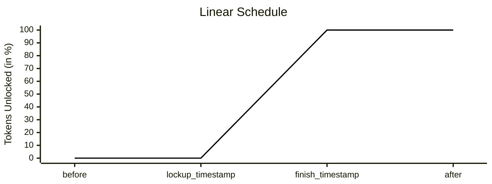
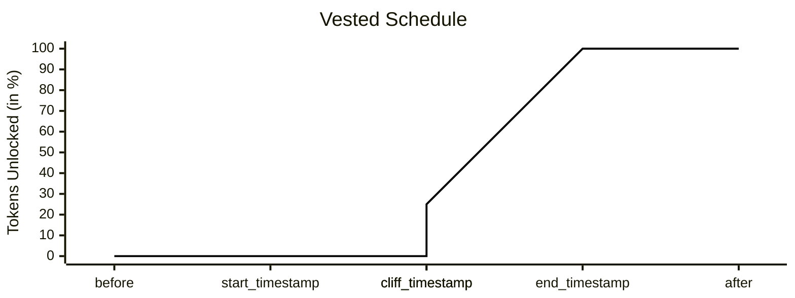
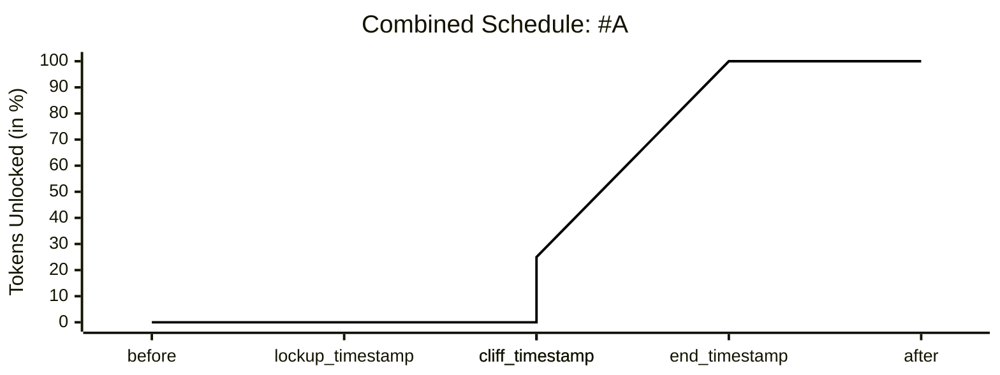
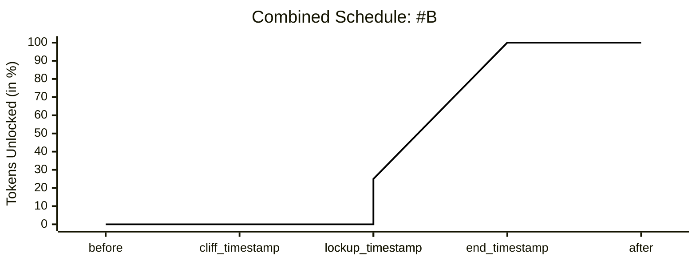

import {FeatureList, Column, Feature} from "@site/src/components/featurelist"

import Tabs from '@theme/Tabs';
import TabItem from '@theme/TabItem';

import { LantstoolLabel } from "@site/src/components/lantstool/LantstoolLabel/LantstoolLabel";
import { TryOutOnLantstool } from "@site/src/components/lantstool/TryOutOnLantstool";

Lockup contracts act as escrows that hold tokens and release them gradually over time. They are widely used to manage employee compensation, investor vesting schedules, or long-term token allocations.

Unlike [Fungible Tokens](ft.md), where transfers happen freely between accounts, lockup contracts restrict token liquidity until predefined conditions are met.  
They combine two key mechanisms:

- **Lockup** – tokens unlock linearly starting from a given timestamp.
- **Vesting** – tokens vest according to a schedule, with optional cliff and early termination rules.

By combining these, projects can enforce predictable token release schedules that align incentives and improve transparency.

---

## Core Concepts

### Lockup Schedule

A lockup defines how tokens are released linearly over time. It is described by:

- `lockup_timestamp` – when unlocking begins.
- `release_duration` – how long the unlocking lasts.  
  By the end, all tokens are available.
- `finish_timestamp = lockup_timestamp + release_duration`



---

### Vesting Schedule

Vesting adds additional conditions, typically used for employment or investment agreements.

It introduces three key timestamps:

- `start_timestamp` – when vesting starts (e.g. hire date).
- `cliff_timestamp` – the first time tokens vest (e.g. 1 year).
- `end_timestamp` – when vesting completes.

Example:
A **4-year vesting** with a **1-year cliff** means:

- Year 1: nothing vests.
- At 1-year mark: 25% vests at once.
- Remaining 75% vests linearly until year 4.



---

### Combined Schedule

Lockup and vesting can be combined. Tokens become liquid only when both conditions allow:

`liquidity_timestamp = max(lockup_timestamp, cliff_timestamp)`

Depending on which event comes first, the outcome for the token release differs.

#### Scenario A: Lockup before Cliff

In this case, the lockup timestamp occurs earlier than the cliff timestamp. Although the lockup schedule would normally allow tokens to start unlocking, the vesting cliff has not yet passed. As a result, no tokens are liquid until the cliff.

It introduces three key timestamps:

- `lockup_timestamp` – occurs earlier than the vesting cliff
- `cliff_timestamp` – comes later, so vesting delays liquidity
- `end_timestamp` – when vesting fully completes



#### Scenario B: Cliff before Lockup

In this case, by the time the cliff is reached, 25% of tokens are considered vested. However, liquidity is still blocked because the lockup period has not ended.

It introduces three key timestamps:

- `cliff_timestamp` – occurs earlier than lockup
- `lockup_timestamp` – comes later and delays liquidity unlock
- `end_timestamp` – when vesting fully completes



---

### Termination by Foundation

When the `foundation_account_id` is specified at initialization, this account is granted the right to terminate vesting before its natural completion. The effect of termination depends on whether it happens before or after the vesting cliff.

- If termination occurs before the cliff date, none of the tokens are considered vested and the entire allocation is refunded back to the foundation.

- If termination happens after the cliff, the portion that has already vested up to that point remains with the owner, while all of the remaining unvested tokens are returned to the foundation.

This ensures that the owner never receives more than what has already vested, while giving the foundation a mechanism to reclaim the locked portion in case of early termination of the agreement.

You’ll discover real examples as you continue reading.

---

### Staking with Locked Tokens

The Lockup contract allows the owner to delegate tokens to a whitelisted staking pool, and it lets the owner to earn additional rewards while their base tokens remain locked.

The process works as follows:

- The owner selects a validator from the whitelist and stakes tokens through the lockup contract.

- The staked amount itself remains locked according to the lockup and vesting schedules.

- The validator generates staking rewards over time.

A crucial distinction is that staking rewards are liquid immediately. They are not bound by the original lockup or vesting conditions. For example, if 1000 NEAR are locked and staked for one month, and 10 NEAR are earned as rewards, when the owner decides to unstake, the original 1000 NEAR follow the normal lockup and vesting restrictions, while any rewards already earned can be transferred directly to your account.

You’ll discover real examples as you continue reading.

---

## Using the Contract

### Deploying Your Own Contract

Lockup contracts on NEAR are deployed as global contracts by hash. This means you don’t have to compile and upload the WASM yourself, instead you can use the published code hash to ensure consistency across deployments.

The critical point is that the locked balance is determined at this moment. Whatever tokens are already on the contract account are locked under the schedule you define. This means that if you are, for example, a company setting up a lockup for an employee, you must first create and fund the lockup account with the intended amount of tokens, and then deploy.

```bash
near contract deploy <account-id> use-global-hash CAvU5MYQ4xk1SjFvbnQDQUj6qehuW5YhU3FXA6GMddCx with-init-call new json-args '{
    "owner_account_id": "employee.near",
    "lockup_duration": "0",
    "lockup_timestamp": "1535760000000000000",
    "release_duration": "126230400000000000",
    "transfers_information": {
            "TransfersEnabled": {
                "transfers_timestamp": "1602614338293769340"
        }
    },
    "vesting_schedule": {
        "VestingSchedule": {
            "start_timestamp": "1535760000000000000",
            "cliff_timestamp": "1567296000000000000",
            "end_timestamp": "1661990400000000000"
        }
    },
    "staking_pool_whitelist_account_id": "staking-pool-whitelist",
    "foundation_account_id": "foundation.near"
}' prepaid-gas '30.0 Tgas' attached-deposit '0 NEAR'
```

:::tip

- To use lockup only: omit the `vesting_schedule` property.

- To use vesting only: set `lockup_timestamp` and `release_duration` to 0 and provide only the `vesting_schedule`.
  :::

### Checking Balance

To see the owner’s balance, run the following command. The returned amount includes both the total amount of tokens in the contract and any staking rewards that are available for withdrawal.

```bash
near contract call-function as-read-only <account-id> get_owners_balance json-args '{}'
```

To see the liquid balance, run the following command. This will return the amount that is available for withdrawal, including unlocked tokens and staking rewards.

```bash
near contract call-function as-read-only <account-id> get_liquid_owners_balance json-args '{}'
```

### Withdraw Tokens

To transfer unlocked tokens to your account, please run the following command.

```bash
near contract call-function as-transaction <account-id> transfer json-args '{
    "amount": "10000000000000000000000000",
    "receiver_id":"owner.near"
}' prepaid-gas '30.0 Tgas' attached-deposit '0 NEAR'
```

:::warning
Requesting to withdraw amount that is greater than liquid won't go through
:::

### Withdraw Tokens Once Fully Unlocked

Once all tokens are fully vested and unlocked, you can convert your lockup account into a regular NEAR account by adding a full access key. This allows you to manage the account directly and withdraw the remaining tokens by leveraging the power of advanced technique, which includes deleting it account completely and specifying your account as beneficiary.

Generate a new key pair and run the following command to add it as full access key to account, once the vesting/locking schedule is finished.

```bash
near contract call-function as-transaction <account-id> add_full_access_key json-args '{
    "new_public_key": "ed25519:8W9CiyPPehz2GRW8AYho9nx1z1GLdeZQCyn2wqYgJjiG"
}' prepaid-gas '30.0 Tgas' attached-deposit '0 NEAR'
```

:::warning
Keep in mind that you never should use the key from the command above. Generate your own key pair.
:::

Once the key is added, you’ll be able to delete it and transfer remaining funds to your account (replace `owner.near` with your address) with the following command.

```bash
near account delete-account <account-id> beneficiary owner.near
```

:::danger
Make sure all staked tokens are fully withdrawn before attempting to delete the account. If any tokens remain delegated to a staking pool, they will be lost once the account is deleted.
:::

---

## Staking

The Lockup contract allows the owner to delegate tokens to a whitelisted staking pool, and it lets the owner to earn additional rewards while their base tokens remain locked.

Let’s walk through each step slowly, in the order you will typically execute the commands.

### Select Staking Pool

Choose a validator from the whitelist configured at initialization, then set it on the lockup contract.

```bash
near contract call-function as-transaction <account-id> select_staking_pool json-args '{
    "staking_pool_account_id": "pool.testnet"
}' prepaid-gas '30.0 Tgas' attached-deposit '0 NEAR'
```

### Deposit and Stake Tokens

Stake part of tokens, available on the lockup contract. The amount must be passed over in yoctoNEAR (1 NEAR = 10^24 yoctoNEAR).

```bash
near contract call-function as-transaction <account-id> deposit_and_stake json-args '{
    "amount": "1000000000000000000000000000"
}' prepaid-gas '125.0 Tgas' attached-deposit '0 NEAR'
```

### Refresh Staking Pool Balance

The rewards from staking pool won't be automatically reflected in the contract. This command synchronizes the contract’s internal balance with the staking pool.

```bash
near contract call-function as-transaction <account-id> refresh_staking_pool_balance json-args '{}' prepaid-gas '30.0 Tgas' attached-deposit '0 NEAR'
```

Once that's done, notice that [liquid balance](#checking-balance) has changed.

### Unstake

When you feel ready, simply request unstake with the following command. You will need to wait standard delay of 4 epochs for funds to become withdrawable from the pool.

```bash
near contract call <account-id> unstake_all json-args '{}' prepaid-gas '125.0 Tgas' attached-deposit '0 NEAR'
```

### Withdraw

As soon as 4 epochs have gone by, run the following command to move the funds from the staking pool back to the contract, including earned rewards.

```bash
near contract call <account-id> withdraw_all_from_staking_pool json-args '{}' prepaid-gas '175.0 Tgas' attached-deposit '0 NEAR'
```

Once that's done, earned rewards become part of liquid balance and [can be withdrawn to your account immediately](#withdraw-tokens).

---

## Termination (for Foundations)

The lockup can be terminated early by a `foundation_account_id`, if it was specified during the initialization. Before the cliff, the entire allocation is refunded to the foundation. After the cliff, only the unvested portion is refunded, while the vested part remains with the owner.

During termination, some owner actions are temporarily paused until the process completes.

### Initiate

Start the termination process. After initiation, the contract may restrict owner actions until termination is finalized.

```bash
near contract call-function as-transaction <account-id> terminate_vesting json-args '{}' prepaid-gas '25.0 Tgas' attached-deposit '0 NEAR'
```

### Check Status

The status tells you which step is safe to run next and prevents failed calls.

For example, a deficit status means there're some tokens left on the staking pool and it [requires additional actions](#resolve-deficit-if-staked) from you.

And, once the contract reports "Ready To Withdraw" status, the foundation can proceed to withdraw.

```bash
near contract call-function as-read-only <account-id> get_termination_status json-args '{}'
```

### Resolve Deficit (if staked)

If some tokens are staked and the contract shows a deficit (not enough liquid balance to refund the unvested portion), prepare the funds.

```bash
near contract call-function as-transaction <account-id> termination_prepare_to_withdraw json-args '{}' prepaid-gas '175.0 Tgas' attached-deposit '0 NEAR'
```

:::warning
You need to call it twice — once to start unstaking, and again after the 4 epoch delay to withdraw your funds.
:::

### Withdraw Unvested

Once the status is ready, withdraw the unvested portion to the foundation account.

```bash
near contract call-function as-transaction <account-id> termination_withdraw json-args '{
  "receiver_id": "foundation.near"
}' prepaid-gas '75.0 Tgas' attached-deposit '0 NEAR'
```

---

## Additional Resources

For more information, explore the official resources below:

- [Lockup Contract Repository](https://github.com/near/core-contracts/tree/master/lockup)
- [NEAR CLI](https://github.com/near/near-cli-rs)
