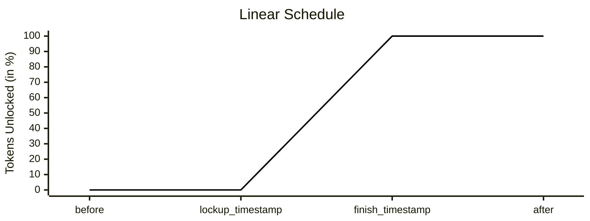
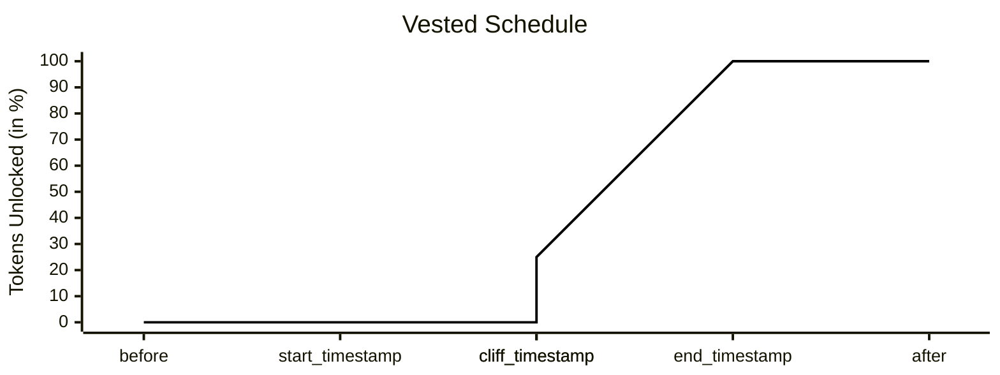
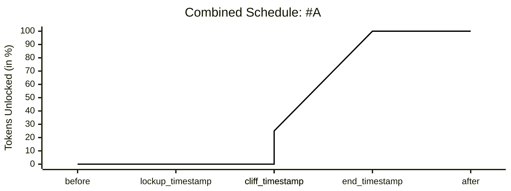
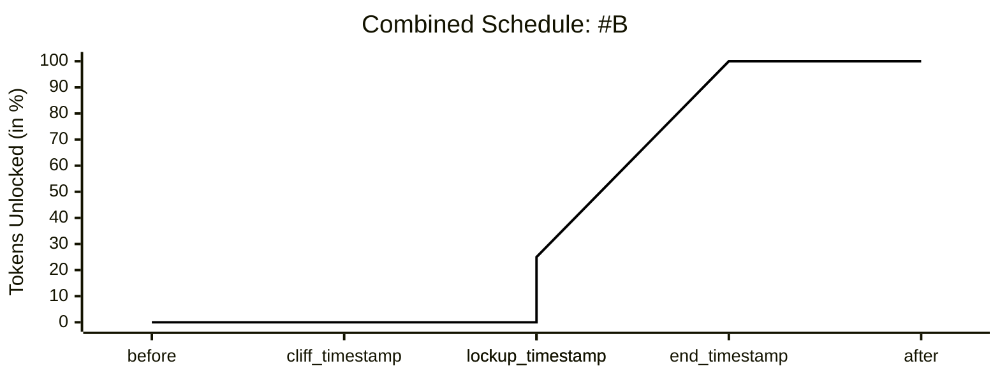

Lockup contracts act as escrows that hold tokens and release them gradually over time. They are widely used to manage employee compensation, investor vesting schedules, or long-term token allocations.

Lockup contracts restrict token liquidity until predefined conditions are met by combining two key mechanisms: 

- **Lockup** – tokens remain locked until a certain date is reached.
- **Vesting** – tokens are made available to the user, but might be released gradually.

Through lockup and vesting, projects can enforce predictable token release schedules that align incentives and improve transparency.

---

## Lockup Schedule

A lockup defines how tokens are released linearly over time. It is described by:

- `lockup_timestamp` – when unlocking begins.
- `release_duration` – how long the unlocking lasts.  
  By the end, all tokens are available.
- `finish_timestamp = lockup_timestamp + release_duration`

---

## Vesting Schedule

Vesting adds additional conditions, typically used for employment or investment agreements:

- `start_timestamp` – when vesting starts (e.g. hire date).
- `cliff_timestamp` – the first time tokens vest (e.g. 1 year).
- `end_timestamp` – when vesting completes.

Example:
A **4-year vesting** with a **1-year cliff** means:

- Year 1: nothing vests.
- At 1-year mark: 25% vests at once.
- Remaining 75% vests linearly for the remaining 3 years.

---

## Combined Schedule

Lockup and vesting can be combined. Tokens become liquid only when both conditions allow:

`liquidity_timestamp = max(lockup_timestamp, cliff_timestamp)`

Depending on which event comes first, the outcome for the token release differs.

### Scenario A: Lockup before Cliff

In this case, the lockup timestamp occurs earlier than the cliff timestamp. Although the lockup schedule would normally allow tokens to start unlocking, the vesting cliff has not yet passed. As a result, no tokens are liquid until the cliff.

It introduces three key timestamps:

- `lockup_timestamp` – occurs earlier than the vesting cliff
- `cliff_timestamp` – comes later, so vesting delays liquidity
- `end_timestamp` – when vesting fully completes

### Scenario B: Cliff before Lockup

In this case, by the time the cliff is reached, 25% of tokens are considered vested. However, liquidity is still blocked because the lockup period has not ended.

It introduces three key timestamps:

- `cliff_timestamp` – occurs earlier than lockup
- `lockup_timestamp` – comes later and delays liquidity unlock
- `end_timestamp` – when vesting fully completes

---

## Termination by Foundation

When the `foundation_account_id` is specified at initialization, this account is granted the right to terminate vesting before its natural completion. The effect of termination depends on whether it happens before or after the vesting cliff.

- If termination occurs before the cliff date, none of the tokens are considered vested and the entire allocation is refunded back to the foundation.

- If termination happens after the cliff, the portion that has already vested up to that point remains with the owner, while all of the remaining unvested tokens are returned to the foundation.

This ensures that the owner never receives more than what has already vested, while giving the foundation a mechanism to reclaim the locked portion in case of early termination of the agreement.

You’ll discover real examples as you continue reading.

---

## Staking with Locked Tokens

The Lockup contract allows the owner to delegate tokens to a whitelisted staking pool, and it lets the owner to earn additional rewards while their base tokens remain locked.

The process works as follows:

- The owner selects a validator from the whitelist and stakes tokens through the lockup contract.

- The staked amount itself remains locked according to the lockup and vesting schedules.

- The validator generates staking rewards over time.

A crucial distinction is that staking rewards are liquid immediately. They are not bound by the original lockup or vesting conditions. For example, if 1000 NEAR are locked and staked for one month, and 10 NEAR are earned as rewards, when the owner decides to unstake, the original 1000 NEAR follow the normal lockup and vesting restrictions, while any rewards already earned can be transferred directly to your account.