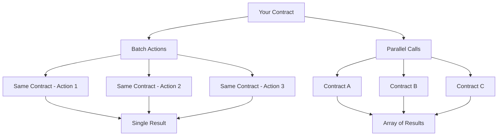

Cross-contract calls are one of NEAR's most powerful features, enabling smart contracts to interact with each other seamlessly. While basic cross-contract calls allow simple interactions, advanced patterns unlock the full potential of NEAR's composable architecture.

## What You'll Build

By the end of this tutorial, you'll master how to:

- **Batch multiple actions** to the same contract with atomic rollback
- **Execute parallel calls** to different contracts simultaneously
- **Handle complex responses** from multiple contract interactions
- **Manage gas efficiently** across multiple contract calls
- **Implement robust error handling** for multi-contract scenarios

## Why Advanced Cross-Contract Calls Matter

These patterns are essential for:

- **DeFi protocols** that interact with multiple token contracts and AMMs
- **Gaming platforms** that manage assets across different contract systems
- **DAO governance** systems that execute proposals across multiple contracts
- **NFT marketplaces** that coordinate with various collection contracts

:::info Source Code

The complete source code is available at [near-examples/cross-contract-calls](https://github.com/near-examples/cross-contract-calls).

Test contracts are deployed on testnet:
- `hello.near-examples.testnet`
- `counter.near-examples.testnet`
- `guestbook.near-examples.testnet`

:::

## How It Works

Advanced cross-contract calls leverage NEAR's promise-based architecture:

Key concepts:

- **Atomicity**: Batch actions either all succeed or all fail
- **Parallelism**: Multiple contracts execute simultaneously
- **Complex responses**: Handle arrays of results with individual success/failure states
- **Gas optimization**: Efficient gas distribution across multiple calls

## What You Will Learn

This tutorial is organized into focused chapters:

1. **[Project Setup](1-setup.md)** - Get the example project running locally
2. **[Batch Actions](2-batch-actions.md)** - Learn atomic multi-action patterns
3. **[Parallel Execution](3-parallel-execution.md)** - Execute multiple contracts simultaneously  
4. **[Response Handling](4-response-handling.md)** - Master complex callback patterns
5. **[Testing & Deployment](5-testing-deployment.md)** - Test and deploy your contracts

Let's [get started with the project setup](1-setup.md)!