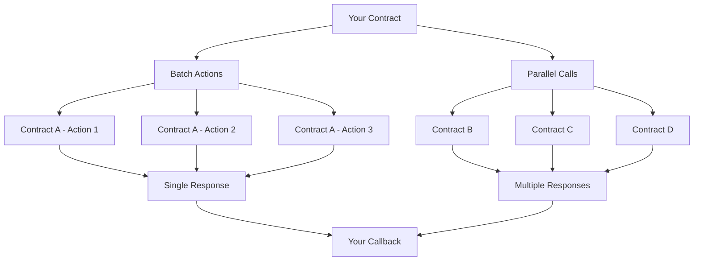

Cross-contract calls are one of NEAR's most powerful features, enabling smart contracts to interact with each other seamlessly. While basic cross-contract calls allow simple interactions, advanced patterns unlock the full potential of NEAR's composable architecture.

In this comprehensive tutorial, you'll learn to build sophisticated multi-contract interactions that can batch operations, execute calls in parallel, and handle complex response patterns - all while maintaining proper error handling and gas management.

## What You'll Build

By the end of this tutorial, you'll have a complete understanding of how to:

- **Batch multiple actions** to the same contract with atomic rollback capabilities
- **Execute parallel calls** to different contracts simultaneously
- **Handle complex responses** from multiple contract interactions
- **Manage gas efficiently** across multiple contract calls
- **Implement robust error handling** for multi-contract scenarios

## Real-World Applications

These advanced patterns are essential for building:

- **DeFi protocols** that interact with multiple token contracts and AMMs
- **Cross-chain bridges** that coordinate with multiple validator contracts  
- **Gaming platforms** that manage assets across different contract systems
- **DAO governance** systems that execute proposals across multiple contracts
- **NFT marketplaces** that coordinate with various collection contracts

## Tutorial Structure

This tutorial is organized into focused, hands-on chapters:

1. **[Project Setup](1-setup.md)** - Get the example project running locally
2. **[Batch Actions](2-batch-actions.md)** - Learn to batch multiple calls with atomic rollback
3. **[Parallel Execution](3-parallel-execution.md)** - Execute multiple contracts simultaneously  
4. **[Response Handling](4-response-handling.md)** - Master complex callback patterns
5. **[Testing & Deployment](5-testing-deployment.md)** - Test and deploy your contracts

## Prerequisites

Before starting, ensure you have:

- Basic understanding of [NEAR smart contracts](../../smart-contracts/intro.md)
- Familiarity with [simple cross-contract calls](../simple-xcc.md)
- [NEAR CLI](../../tooling/near-cli.md) installed and configured
- A NEAR testnet account with some tokens

:::info Understanding Cross-Contract Calls

If you're new to cross-contract calls, we recommend starting with our [simple cross-contract calls tutorial](../simple-xcc.md) before diving into these advanced patterns.

:::

## How Advanced Cross-Contract Calls Work

Advanced cross-contract calls leverage NEAR's promise-based architecture to create sophisticated interaction patterns:

The key differences from simple cross-contract calls:

- **Atomicity**: Batch actions either all succeed or all fail
- **Parallelism**: Multiple contracts can be called simultaneously
- **Complex responses**: Handle arrays of results with individual success/failure states
- **Gas optimization**: Efficient gas distribution across multiple calls

Ready to dive in? Let's [get started with the project setup](1-setup.md)!

:::tip Expert Tip

Advanced cross-contract calls are powerful but complex. Always test thoroughly in a sandbox environment before deploying to mainnet, as gas costs and failure modes can be difficult to predict.

:::