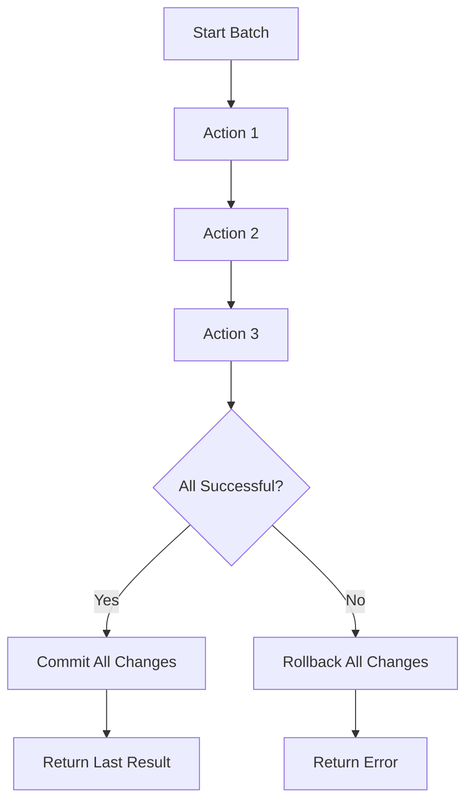

import Tabs from '@theme/Tabs';
import TabItem from '@theme/TabItem';
import {Github} from "@site/src/components/codetabs"

Batch actions allow you to execute multiple function calls to the same contract sequentially, with a powerful guarantee: **if any action fails, all actions in the batch are reverted**. This atomic behavior is crucial for maintaining consistency in complex operations.

## Understanding Batch Actions

When you batch multiple actions together:

1. **Sequential execution**: Actions execute one after another in the specified order
2. **Atomic rollback**: If any action fails, the entire batch is reverted  
3. **Single gas payment**: All actions share gas from the initial call
4. **Last result access**: Your callback receives the result of the final action



## Implementing Batch Actions

Let's examine how to implement batch actions in your contract:

<Tabs groupId="code-tabs">
  <TabItem value="js" label="🌐 TypeScript">

<Github fname="contract.ts"
      url="https://github.com/near-examples/cross-contract-calls/blob/main/contract-advanced-ts/src/contract.ts"
      start="38" end="41" />

<Github fname="batch_actions.ts"
      url="https://github.com/near-examples/cross-contract-calls/blob/main/contract-advanced-ts/src/internal/batch_actions.ts"
      start="5" end="17" />

  </TabItem>
  <TabItem value="rust" label="🦀 Rust">

<Github fname="lib.rs"
        url="https://github.com/near-examples/cross-contract-calls/blob/main/contract-advanced-rs/src/lib.rs"
        start="30" end="35" />

<Github fname="batch_actions.rs"
        url="https://github.com/near-examples/cross-contract-calls/blob/main/contract-advanced-rs/src/batch_actions.rs"
        start="8" end="20" />

  </TabItem>
</Tabs>

### Key Components Explained

**1. Promise Chaining**: Each action is chained using `.then()`, ensuring sequential execution:

<Tabs groupId="code-tabs">
  <TabItem value="js" label="🌐 TypeScript">

```typescript
// Actions execute in sequence: set_greeting → increment → decrement
const promise = NearPromise.new(this.hello_account)
  .functionCall("set_greeting", JSON.stringify({message: "XCC"}), 0n, 30_000_000_000_000n)
  .then(
    NearPromise.new(this.counter_account)
      .functionCall("increment", JSON.stringify({}), 0n, 5_000_000_000_000n)
  )
  .then(
    NearPromise.new(this.counter_account)
      .functionCall("decrement", JSON.stringify({}), 0n, 5_000_000_000_000n)
  );
```

  </TabItem>
  <TabItem value="rust" label="🦀 Rust">

```rust
// Actions execute in sequence: set_greeting → increment → decrement
let promise = Promise::new(self.hello_account.clone())
    .function_call(
        "set_greeting".to_owned(),
        json!({"message": "XCC"}).to_string().into_bytes(),
        0,
        Gas::from_tgas(30),
    )
    .then(Promise::new(self.counter_account.clone()).function_call(
        "increment".to_owned(),
        json!({}).to_string().into_bytes(),
        0,
        Gas::from_tgas(5),
    ))
    .then(Promise::new(self.counter_account.clone()).function_call(
        "decrement".to_owned(), 
        json!({}).to_string().into_bytes(),
        0,
        Gas::from_tgas(5),
    ));
```

  </TabItem>
</Tabs>

**2. Gas Management**: Each action specifies its own gas allocation. The total gas must not exceed your available gas.

**3. Callback Registration**: The final `.then()` registers a callback to handle the result.

## Handling Batch Responses

The callback method receives only the result from the **last action** in the chain:

<Tabs groupId="code-tabs">
  <TabItem value="js" label="🌐 TypeScript">

<Github fname="contract.ts"
      url="https://github.com/near-examples/cross-contract-calls/blob/main/contract-advanced-ts/src/contract.ts"
      start="43" end="46" />

<Github fname="batch_actions.ts"
      url="https://github.com/near-examples/cross-contract-calls/blob/main/contract-advanced-ts/src/internal/batch_actions.ts"
      start="19" end="29" />

  </TabItem>
  <TabItem value="rust" label="🦀 Rust">

<Github fname="batch_actions.rs"
        url="https://github.com/near-examples/cross-contract-calls/blob/main/contract-advanced-rs/src/batch_actions.rs"
        start="22" end="35" />

  </TabItem>
</Tabs>

### Response Processing

<Tabs groupId="code-tabs">
  <TabItem value="js" label="🌐 TypeScript">

<Github fname="utils.ts"
      url="https://github.com/near-examples/cross-contract-calls/blob/main/contract-advanced-ts/src/internal/utils.ts"
      start="3" end="20" />

  </TabItem>
  <TabItem value="rust" label="🦀 Rust">

```rust
// In Rust, you can directly access the promise result
match env::promise_result(0) {
    PromiseResult::Successful(result) => {
        let counter_value: i8 = near_sdk::serde_json::from_slice(&result)
            .unwrap_or_else(|_| 0);
        format!("Batch completed. Final counter value: {}", counter_value)
    }
    PromiseResult::Failed => "Batch failed - all actions reverted".to_string(),
}
```

  </TabItem>
</Tabs>

## Real-World Example: Token Transfer Batch

Here's a practical example that demonstrates batch actions in a DeFi context:

<Tabs groupId="code-tabs">
  <TabItem value="js" label="🌐 TypeScript">

```typescript
// Example: Batch token operations (approve + transfer + stake)
@call({})
batch_token_operations({
  token_account,
  amount, 
  recipient,
  staking_pool
}: {
  token_account: AccountId;
  amount: string;
  recipient: AccountId; 
  staking_pool: AccountId;
}) {
  // 1. Approve token spending
  const promise = NearPromise.new(token_account)
    .functionCall(
      "ft_approve", 
      JSON.stringify({spender_id: env.current_account_id(), amount}),
      1n, // 1 yoctoNEAR for storage
      10_000_000_000_000n
    )
    // 2. Transfer tokens
    .then(
      NearPromise.new(token_account)
        .functionCall(
          "ft_transfer",
          JSON.stringify({receiver_id: recipient, amount}), 
          1n,
          15_000_000_000_000n
        )
    )
    // 3. Stake in pool
    .then(
      NearPromise.new(staking_pool)
        .functionCall(
          "deposit_and_stake",
          JSON.stringify({}),
          BigInt(amount), // Attach the tokens as deposit
          20_000_000_000_000n
        )
    )
    // 4. Handle the result
    .then(
      NearPromise.new(env.current_account_id())
        .functionCall(
          "batch_token_callback",
          JSON.stringify({original_amount: amount}),
          0n,
          10_000_000_000_000n
        )
    );

  return promise;
}
```

  </TabItem>
  <TabItem value="rust" label="🦀 Rust">

```rust
// Example: Batch token operations (approve + transfer + stake)
#[payable]
pub fn batch_token_operations(
    &mut self,
    token_account: AccountId,
    amount: U128,
    recipient: AccountId,
    staking_pool: AccountId,
) -> Promise {
    // 1. Approve token spending
    Promise::new(token_account.clone())
        .function_call(
            "ft_approve".to_owned(),
            json!({"spender_id": env::current_account_id(), "amount": amount})
                .to_string().into_bytes(),
            1, // 1 yoctoNEAR for storage
            Gas::from_tgas(10),
        )
        // 2. Transfer tokens  
        .then(Promise::new(token_account).function_call(
            "ft_transfer".to_owned(),
            json!({"receiver_id": recipient, "amount": amount})
                .to_string().into_bytes(),
            1,
            Gas::from_tgas(15),
        ))
        // 3. Stake in pool
        .then(Promise::new(staking_pool).function_call(
            "deposit_and_stake".to_owned(),
            json!({}).to_string().into_bytes(),
            amount.0, // Attach the tokens as deposit
            Gas::from_tgas(20),
        ))
        // 4. Handle the result
        .then(Promise::new(env::current_account_id()).function_call(
            "batch_token_callback".to_owned(),
            json!({"original_amount": amount}).to_string().into_bytes(),
            0,
            Gas::from_tgas(10),
        ))
}
```

  </TabItem>
</Tabs>

## Testing Batch Actions

Let's test our batch actions to see both success and failure scenarios:

<Tabs groupId="code-tabs">
  <TabItem value="js" label="🌐 TypeScript">

```typescript
// Test successful batch
test('batch actions execute sequentially', async (t) => {
  const contract = t.context.contract;
  
  // Execute batch actions
  const result = await contract.call(
    'batch_actions', 
    {},
    { gas: '300000000000000' }
  );
  
  // Should return result from last action (counter decrement)
  t.is(result, 'Batch completed. Final counter value: 0');
});

// Test batch failure and rollback
test('batch actions rollback on failure', async (t) => {
  const contract = t.context.contract;
  
  // This batch will fail on the second action
  const result = await contract.call(
    'batch_actions_with_failure',
    {},
    { gas: '300000000000000' }
  );
  
  // Should indicate failure
  t.is(result, 'Batch failed - all actions reverted');
  
  // Verify the first action was also rolled back
  const greeting = await contract.view('get_greeting');
  t.not(greeting, 'XCC'); // Should not be the value from failed batch
});
```

  </TabItem>
  <TabItem value="rust" label="🦀 Rust">

```rust
#[tokio::test]
async fn test_batch_actions_success() -> Result<(), Box<dyn std::error::Error>> {
    let sandbox = near_workspaces::sandbox().await?;
    let contract = sandbox.dev_account().await?;
    
    // Deploy and initialize contract
    let wasm = near_workspaces::compile_project("./").await?;
    let contract = contract.deploy(&wasm).await?.unwrap();
    
    // Execute batch actions
    let result = contract
        .call("batch_actions")
        .gas(300_000_000_000_000)
        .transact()
        .await?;
    
    assert!(result.is_success());
    
    Ok(())
}

#[tokio::test] 
async fn test_batch_actions_rollback() -> Result<(), Box<dyn std::error::Error>> {
    // Test that failed batch actions rollback properly
    // Implementation details...
    Ok(())
}
```

  </TabItem>
</Tabs>

## Common Pitfalls and Best Practices

### ❌ Common Mistakes

1. **Insufficient Gas**: Not allocating enough gas for all actions in the chain
2. **Wrong Order**: Placing dependent actions before their dependencies
3. **Ignoring Failures**: Not handling callback failures properly

### ✅ Best Practices

1. **Gas Planning**: Always allocate sufficient gas for each action plus callback overhead
2. **Error Handling**: Implement comprehensive error handling in callbacks
3. **State Validation**: Verify contract state before and after batch operations
4. **Atomic Design**: Design batches to be truly atomic - either all succeed or all fail

## Gas Optimization Tips

```typescript
// Good: Allocate appropriate gas for each action
.functionCall("simple_action", args, 0n, 5_000_000_000_000n)   // 5 TGas
.functionCall("complex_action", args, 0n, 15_000_000_000_000n) // 15 TGas  
.functionCall("callback", args, 0n, 10_000_000_000_000n)       // 10 TGas callback

// Bad: Over-allocating gas wastes user funds
.functionCall("simple_action", args, 0n, 50_000_000_000_000n)  // Too much!
```

## Next Steps

Now that you understand batch actions, let's explore [parallel execution](3-parallel-execution.md) where you'll learn to call multiple different contracts simultaneously for maximum efficiency.

:::tip When to Use Batch Actions

Batch actions are perfect when you need:
- **Atomic operations** across multiple function calls
- **Sequential execution** where later actions depend on earlier ones  
- **Single contract interactions** with multiple related operations
- **Rollback guarantees** - all or nothing execution

For independent operations across different contracts, consider [parallel execution](3-parallel-execution.md) instead.

:::