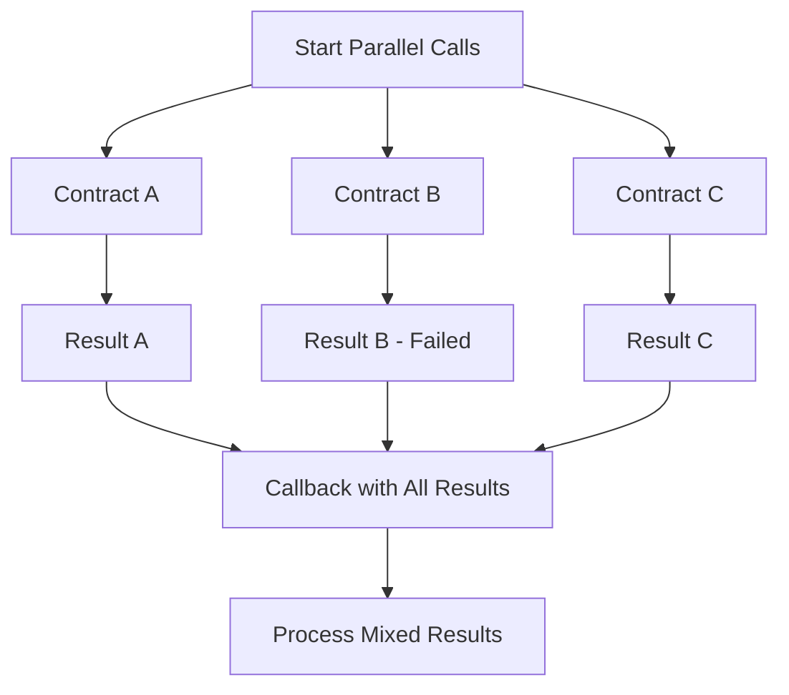

import Tabs from '@theme/Tabs';
import TabItem from '@theme/TabItem';
import {Github} from "@site/src/components/codetabs"

Parallel execution allows you to call multiple contracts simultaneously, dramatically improving efficiency when you need to gather data or perform operations across different contracts. Unlike batch actions, **parallel calls execute independently - if one fails, the others continue**.

## Understanding Parallel Execution

When you execute contracts in parallel:

1. **Simultaneous execution**: All contracts are called at the same time
2. **Independent results**: Each call succeeds or fails independently  
3. **Faster completion**: Total execution time is limited by the slowest call
4. **Array of results**: Your callback receives all results as an array



## Implementing Parallel Execution

Let's examine how to implement parallel contract calls:

<Tabs groupId="code-tabs">
  <TabItem value="js" label="🌐 TypeScript">

<Github fname="contract.ts"
      url="https://github.com/near-examples/cross-contract-calls/blob/main/contract-advanced-ts/src/contract.ts"
      start="48" end="51" />

<Github fname="multiple_contracts.ts"
      url="https://github.com/near-examples/cross-contract-calls/blob/main/contract-advanced-ts/src/internal/multiple_contracts.ts"
      start="6" end="21" />

  </TabItem>
  <TabItem value="rust" label="🦀 Rust">

<Github fname="lib.rs"
        url="https://github.com/near-examples/cross-contract-calls/blob/main/contract-advanced-rs/src/lib.rs"
        start="37" end="42" />

<Github fname="multiple_contracts.rs"
        url="https://github.com/near-examples/cross-contract-calls/blob/main/contract-advanced-rs/src/multiple_contracts.rs"
        start="16" end="55" />

  </TabItem>
</Tabs>

### Key Components Explained

**1. Independent Promises**: Each contract call creates a separate promise:

<Tabs groupId="code-tabs">
  <TabItem value="js" label="🌐 TypeScript">

```typescript
// Three independent promises execute simultaneously
const hello_promise = NearPromise.new(this.hello_account)
  .functionCall("get_greeting", JSON.stringify({}), 0n, 5_000_000_000_000n);

const counter_promise = NearPromise.new(this.counter_account)  
  .functionCall("get_num", JSON.stringify({}), 0n, 5_000_000_000_000n);

const guestbook_promise = NearPromise.new(this.guestbook_account)
  .functionCall("get_messages", JSON.stringify({}), 0n, 5_000_000_000_000n);
```

  </TabItem>
  <TabItem value="rust" label="🦀 Rust">

```rust
// Three independent promises execute simultaneously
let hello_promise = Promise::new(self.hello_account.clone())
    .function_call(
        "get_greeting".to_owned(),
        json!({}).to_string().into_bytes(),
        0,
        Gas::from_tgas(5),
    );

let counter_promise = Promise::new(self.counter_account.clone())
    .function_call(
        "get_num".to_owned(),
        json!({}).to_string().into_bytes(), 
        0,
        Gas::from_tgas(5),
    );

let guestbook_promise = Promise::new(self.guestbook_account.clone())
    .function_call(
        "get_messages".to_owned(),
        json!({}).to_string().into_bytes(),
        0,
        Gas::from_tgas(5),
    );
```

  </TabItem>
</Tabs>

**2. Promise Combination**: Use `and()` to combine promises for parallel execution:

<Tabs groupId="code-tabs">
  <TabItem value="js" label="🌐 TypeScript">

```typescript
// Combine promises for parallel execution
return hello_promise
  .and(counter_promise)
  .and(guestbook_promise)
  .then(
    NearPromise.new(env.current_account_id())
      .functionCall(
        "multiple_contracts_callback",
        JSON.stringify({}),
        0n,
        10_000_000_000_000n
      )
  );
```

  </TabItem>
  <TabItem value="rust" label="🦀 Rust">

```rust
// Combine promises for parallel execution
hello_promise
    .and(counter_promise)
    .and(guestbook_promise)
    .then(Promise::new(env::current_account_id()).function_call(
        "multiple_contracts_callback".to_owned(),
        json!({}).to_string().into_bytes(),
        0,
        Gas::from_tgas(10),
    ))
```

  </TabItem>
</Tabs>

## Handling Parallel Responses

The callback method receives an **array of results**, where each element corresponds to one of your parallel calls:

<Tabs groupId="code-tabs">
  <TabItem value="js" label="🌐 TypeScript">

<Github fname="contract.ts"
      url="https://github.com/near-examples/cross-contract-calls/blob/main/contract-advanced-ts/src/contract.ts"
      start="53" end="58" />

<Github fname="multiple_contracts.ts"
      url="https://github.com/near-examples/cross-contract-calls/blob/main/contract-advanced-ts/src/internal/multiple_contracts.ts"
      start="24" end="41" />

  </TabItem>
  <TabItem value="rust" label="🦀 Rust">

<Github fname="multiple_contracts.rs"
        url="https://github.com/near-examples/cross-contract-calls/blob/main/contract-advanced-rs/src/multiple_contracts.rs"
        start="58" end="92" />

  </TabItem>
</Tabs>

### Response Processing Pattern

<Tabs groupId="code-tabs">
  <TabItem value="js" label="🌐 TypeScript">

```typescript
// Process each result individually
for (let i = 0; i < promiseResults.length; i++) {
  const result = getValueFromPromise(i);
  
  if (result.success) {
    switch(i) {
      case 0: // Hello contract result
        responses.push(`Hello: ${result.value}`);
        break;
      case 1: // Counter contract result  
        responses.push(`Counter: ${result.value}`);
        break;
      case 2: // Guestbook contract result
        const messages = JSON.parse(result.value);
        responses.push(`Messages: ${messages.length} total`);
        break;
    }
  } else {
    responses.push(`Contract ${i} failed: ${result.error || 'Unknown error'}`);
  }
}
```

  </TabItem>
  <TabItem value="rust" label="🦀 Rust">

```rust
// Process each result individually
for i in 0..3 {
    match env::promise_result(i) {
        PromiseResult::Successful(result) => {
            match i {
                0 => {
                    // Hello contract result
                    let greeting: String = near_sdk::serde_json::from_slice(&result)
                        .unwrap_or_else(|_| "Failed to parse greeting".to_string());
                    responses.push(format!("Hello: {}", greeting));
                }
                1 => {
                    // Counter contract result
                    let count: i8 = near_sdk::serde_json::from_slice(&result)
                        .unwrap_or_else(|_| 0);
                    responses.push(format!("Counter: {}", count));
                }
                2 => {
                    // Guestbook contract result  
                    let messages: Vec<String> = near_sdk::serde_json::from_slice(&result)
                        .unwrap_or_else(|_| Vec::new());
                    responses.push(format!("Messages: {} total", messages.len()));
                }
                _ => {}
            }
        }
        PromiseResult::Failed => {
            responses.push(format!("Contract {} failed", i));
        }
    }
}
```

  </TabItem>
</Tabs>

## Real-World Example: DeFi Portfolio Dashboard

Here's a practical example that fetches portfolio data from multiple DeFi protocols:

<Tabs groupId="code-tabs">
  <TabItem value="js" label="🌐 TypeScript">

```typescript
@call({})
get_portfolio_summary({
  user_account,
  token_contract,
  lending_contract, 
  staking_contract,
  dex_contract
}: {
  user_account: AccountId;
  token_contract: AccountId;
  lending_contract: AccountId;
  staking_contract: AccountId;
  dex_contract: AccountId;
}) {
  // Get token balance
  const balance_promise = NearPromise.new(token_contract)
    .functionCall(
      "ft_balance_of", 
      JSON.stringify({account_id: user_account}),
      0n, 
      5_000_000_000_000n
    );

  // Get lending position
  const lending_promise = NearPromise.new(lending_contract)
    .functionCall(
      "get_account_positions",
      JSON.stringify({account_id: user_account}),
      0n,
      10_000_000_000_000n
    );

  // Get staking rewards
  const staking_promise = NearPromise.new(staking_contract)
    .functionCall(
      "get_unclaimed_rewards",
      JSON.stringify({account_id: user_account}),
      0n,
      5_000_000_000_000n
    );

  // Get DEX liquidity positions  
  const dex_promise = NearPromise.new(dex_contract)
    .functionCall(
      "get_user_liquidity",
      JSON.stringify({account_id: user_account}),
      0n,
      8_000_000_000_000n
    );

  // Execute all in parallel
  return balance_promise
    .and(lending_promise)
    .and(staking_promise)
    .and(dex_promise)
    .then(
      NearPromise.new(env.current_account_id())
        .functionCall(
          "portfolio_callback",
          JSON.stringify({user_account}),
          0n,
          15_000_000_000_000n
        )
    );
}

@call({privateFunction: true})
portfolio_callback({user_account}: {user_account: AccountId}) {
  const results = [];
  
  // Process token balance
  const balance_result = getValueFromPromise(0);
  const balance = balance_result.success ? 
    JSON.parse(balance_result.value) : "0";
  
  // Process lending position
  const lending_result = getValueFromPromise(1);
  const lending_data = lending_result.success ? 
    JSON.parse(lending_result.value) : {supplied: "0", borrowed: "0"};
  
  // Process staking rewards
  const staking_result = getValueFromPromise(2);  
  const rewards = staking_result.success ?
    JSON.parse(staking_result.value) : "0";
  
  // Process DEX positions
  const dex_result = getValueFromPromise(3);
  const liquidity = dex_result.success ?
    JSON.parse(dex_result.value) : [];

  return {
    user_account,
    portfolio: {
      token_balance: balance,
      lending: lending_data,
      staking_rewards: rewards,
      liquidity_positions: liquidity,
      timestamp: env.block_timestamp_ms()
    }
  };
}
```

  </TabItem>
  <TabItem value="rust" label="🦀 Rust">

```rust
pub fn get_portfolio_summary(
    &mut self,
    user_account: AccountId,
    token_contract: AccountId,
    lending_contract: AccountId,
    staking_contract: AccountId, 
    dex_contract: AccountId,
) -> Promise {
    // Get token balance
    let balance_promise = Promise::new(token_contract)
        .function_call(
            "ft_balance_of".to_owned(),
            json!({"account_id": user_account}).to_string().into_bytes(),
            0,
            Gas::from_tgas(5),
        );

    // Get lending position
    let lending_promise = Promise::new(lending_contract)
        .function_call(
            "get_account_positions".to_owned(),
            json!({"account_id": user_account}).to_string().into_bytes(),
            0,
            Gas::from_tgas(10),
        );

    // Get staking rewards
    let staking_promise = Promise::new(staking_contract)
        .function_call(
            "get_unclaimed_rewards".to_owned(),
            json!({"account_id": user_account}).to_string().into_bytes(),
            0,
            Gas::from_tgas(5),
        );

    // Get DEX liquidity positions
    let dex_promise = Promise::new(dex_contract)
        .function_call(
            "get_user_liquidity".to_owned(), 
            json!({"account_id": user_account}).to_string().into_bytes(),
            0,
            Gas::from_tgas(8),
        );

    // Execute all in parallel
    balance_promise
        .and(lending_promise)
        .and(staking_promise)
        .and(dex_promise)
        .then(Promise::new(env::current_account_id()).function_call(
            "portfolio_callback".to_owned(),
            json!({"user_account": user_account}).to_string().into_bytes(),
            0,
            Gas::from_tgas(15),
        ))
}

#[private]
pub fn portfolio_callback(&mut self, user_account: AccountId) -> serde_json::Value {
    let mut portfolio = serde_json::Map::new();

    // Process token balance (index 0)
    if let PromiseResult::Successful(result) = env::promise_result(0) {
        let balance: String = near_sdk::serde_json::from_slice(&result)
            .unwrap_or_else(|_| "0".to_string());
        portfolio.insert("token_balance".to_string(), json!(balance));
    }

    // Process lending position (index 1)  
    if let PromiseResult::Successful(result) = env::promise_result(1) {
        let lending_data: serde_json::Value = near_sdk::serde_json::from_slice(&result)
            .unwrap_or_else(|_| json!({"supplied": "0", "borrowed": "0"}));
        portfolio.insert("lending".to_string(), lending_data);
    }

    // Process staking rewards (index 2)
    if let PromiseResult::Successful(result) = env::promise_result(2) {
        let rewards: String = near_sdk::serde_json::from_slice(&result)
            .unwrap_or_else(|_| "0".to_string());
        portfolio.insert("staking_rewards".to_string(), json!(rewards));
    }

    // Process DEX positions (index 3)
    if let PromiseResult::Successful(result) = env::promise_result(3) {
        let liquidity: Vec<serde_json::Value> = near_sdk::serde_json::from_slice(&result)
            .unwrap_or_else(|_| Vec::new());
        portfolio.insert("liquidity_positions".to_string(), json!(liquidity));
    }

    json!({
        "user_account": user_account,
        "portfolio": portfolio,
        "timestamp": env::block_timestamp_ms()
    })
}
```

  </TabItem>
</Tabs>

## Testing Parallel Execution

Let's test parallel execution to verify both successful and mixed result scenarios:

<Tabs groupId="code-tabs">
  <TabItem value="js" label="🌐 TypeScript">

```typescript
test('parallel execution handles mixed results', async (t) => {
  const contract = t.context.contract;
  
  // Execute parallel calls
  const result = await contract.call(
    'multiple_contracts',
    {},
    { gas: '300000000000000' }
  );
  
  // Should contain results from all contracts
  t.true(result.includes('Hello:'));
  t.true(result.includes('Counter:'));
  t.true(result.includes('Messages:'));
});

test('parallel execution continues on individual failures', async (t) => {
  // Test with one contract failing
  const contract = t.context.contract;
  
  // Simulate a scenario where one contract is unavailable
  const result = await contract.call(
    'multiple_contracts_with_failure',
    {},
    { gas: '300000000000000' }
  );
  
  // Should show some successes and some failures
  t.true(result.includes('failed'));
  t.true(result.includes('Hello:') || result.includes('Counter:'));
});
```

  </TabItem>
  <TabItem value="rust" label="🦀 Rust">

```rust
#[tokio::test]
async fn test_parallel_execution_success() -> Result<(), Box<dyn std::error::Error>> {
    let sandbox = near_workspaces::sandbox().await?;
    let contract = sandbox.dev_account().await?;
    
    // Deploy and test parallel execution
    let wasm = near_workspaces::compile_project("./").await?;
    let contract = contract.deploy(&wasm).await?.unwrap();
    
    let result = contract
        .call("multiple_contracts")
        .gas(300_000_000_000_000)
        .transact()
        .await?;
    
    assert!(result.is_success());
    
    // Verify response contains data from all contracts
    let response: String = result.json()?;
    assert!(response.contains("Hello:"));
    assert!(response.contains("Counter:"));
    
    Ok(())
}

#[tokio::test]
async fn test_parallel_execution_partial_failure() -> Result<(), Box<dyn std::error::Error>> {
    // Test that parallel execution handles partial failures gracefully
    // Implementation details...
    Ok(())
}
```

  </TabItem>
</Tabs>

## Performance Benefits

Parallel execution provides significant performance improvements:

```typescript
// Sequential execution: ~300ms total
await contract1.method(); // 100ms
await contract2.method(); // 100ms  
await contract3.method(); // 100ms

// Parallel execution: ~100ms total (limited by slowest call)
Promise.all([
  contract1.method(), // 100ms
  contract2.method(), // 50ms
  contract3.method()  // 75ms  
]); // Completes in ~100ms
```

## Error Handling Strategies

### Strategy 1: Graceful Degradation

```typescript
// Continue with available data even if some calls fail
portfolio_callback() {
  const results = {
    balance: "0",
    rewards: "0", 
    positions: []
  };
  
  // Try to get balance, use default if failed
  const balance_result = getValueFromPromise(0);
  if (balance_result.success) {
    results.balance = JSON.parse(balance_result.value);
  }
  
  // Try to get rewards, use default if failed
  const rewards_result = getValueFromPromise(1);
  if (rewards_result.success) {
    results.rewards = JSON.parse(rewards_result.value);
  }
  
  return results; // Always return something useful
}
```

### Strategy 2: Partial Retry

```typescript
// Retry failed calls with exponential backoff
portfolio_callback_with_retry() {
  const failed_calls = [];
  
  for (let i = 0; i < promise_count; i++) {
    const result = getValueFromPromise(i);
    if (!result.success) {
      failed_calls.push(i);
    }
  }
  
  if (failed_calls.length > 0) {
    // Initiate retry for failed calls
    return this.retry_failed_calls(failed_calls);
  }
  
  return this.process_all_results();
}
```

## Common Pitfalls and Best Practices

### ❌ Common Mistakes

1. **Result Index Confusion**: Not matching promise results to the correct contract calls
2. **Insufficient Error Handling**: Not handling individual contract failures gracefully
3. **Gas Miscalculation**: Not accounting for callback gas in total gas estimation

### ✅ Best Practices  

1. **Document Result Order**: Clearly document which promise index corresponds to which contract
2. **Implement Fallbacks**: Always have fallback values for failed calls
3. **Monitor Performance**: Track which contracts are slow or frequently failing
4. **Use Timeouts**: Consider implementing timeouts for slow contract calls

## Gas Optimization for Parallel Calls

```typescript
// Good: Allocate appropriate gas for each contract type
const light_call_gas = 5_000_000_000_000n;   // 5 TGas for simple view calls
const medium_call_gas = 15_000_000_000_000n;  // 15 TGas for complex operations  
const heavy_call_gas = 30_000_000_000_000n;   // 30 TGas for heavy computations

// Estimate total gas needed
const estimated_gas = (light_calls * light_call_gas) + 
                     (medium_calls * medium_call_gas) + 
                     (callback_gas);

// Add buffer for safety (10-20%)
const total_gas = estimated_gas * 1.2;
```

## When to Use Parallel vs Batch

| Use Parallel When: | Use Batch When: |
|-------------------|-----------------|
| ✅ Calling different contracts | ✅ Calling same contract multiple times |
| ✅ Independent operations | ✅ Dependent sequential operations |
| ✅ Can handle partial failures | ✅ Need atomic rollback |
| ✅ Performance is critical | ✅ Consistency is critical |
| ✅ Gathering data from multiple sources | ✅ Executing related business logic |

## Next Steps

Now that you understand parallel execution, let's dive into [advanced response handling](4-response-handling.md) where you'll learn sophisticated patterns for processing complex results from multiple contracts.

:::tip Performance vs Reliability Trade-off

Parallel execution optimizes for performance and availability - you get results faster and can handle individual failures. However, if you need strong consistency guarantees, consider using [batch actions](2-batch-actions.md) instead.

:::