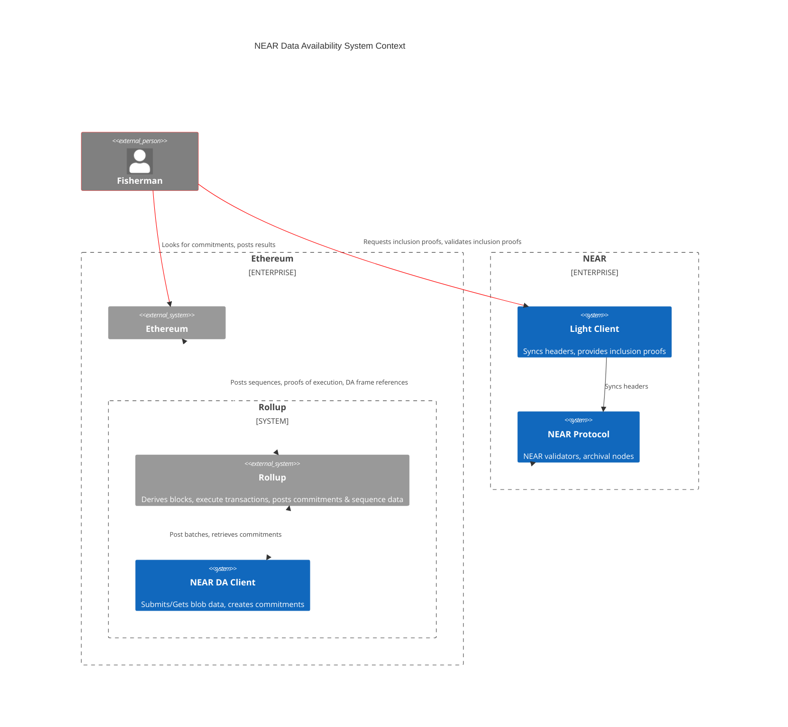

Utilizing NEAR as storage data availability with a focus on lowering rollup DA fees.

- [Blob Store Contract](./blob-contract): A contract that provides the store for arbitrary DA blobs.
- [Light Client](./light-client): A trustless off-chain light client for NEAR with DA-enabled features.
- [RPC Client](./rpc): The defacto client for submitting data blobs to NEAR.
- [Integrations](./integrations): Proof of concept works for integrating with L2 rollups.

:::tip
For the latest information, please check the [Near DA](https://github.com/near/rollup-data-availability/) repository.
:::

***

## System Context

This outlines the system components that we build and how it interacts with external components.

Red lines denote external flow of commitments.
White lines denote flow of blob data.

:::note

`Fisherman` is just an example how a rollup can work with the light client in the initial stage of DA, until we implement a more non-interactive approach, such as KZG.

:::

