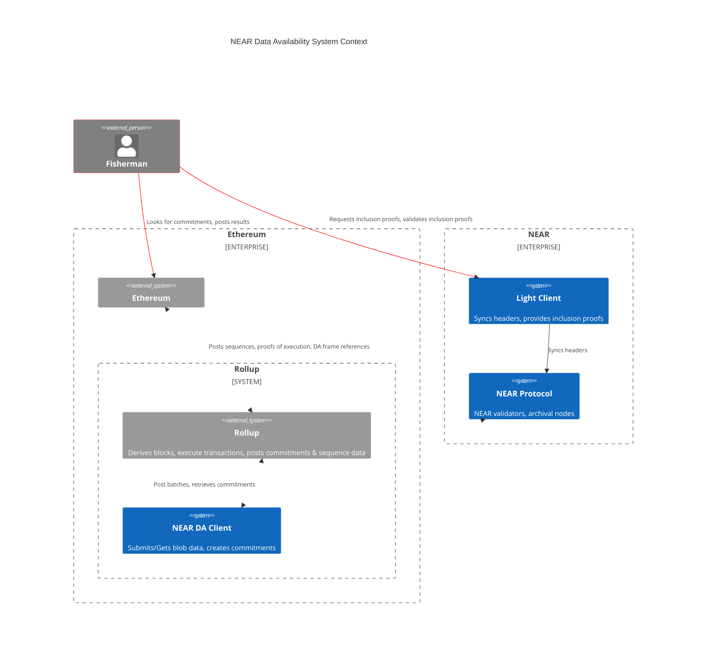

每条单体区块链都有一个数据可用性层。NEAR 的数据可用性（DA）代表了一项开创性举措，旨在将数据可用性层从 NEAR 区块链中模块化，使其可作为其他链上构建者的 Rollup 解决方案使用。

该基础设施由智能合约、轻客户端和远程过程调用（RPC）节点组成。智能合约设计用于接受 Blob 数据，这些数据随后经过 NEAR 的共识处理。RPC 节点作为服务节点运行，用户可以向其传输数据。最后，轻客户端作为一个节点运行，Rollup 可通过它验证数据的可用性。

- [Blob 存储合约](#blob-store-contract)：一个为任意 DA Blob 提供存储的合约。
- [轻客户端](#light-client)：一个具有 DA 功能的 NEAR 无信任链下轻客户端。
- [RPC 客户端](#da-rpc)：向 NEAR 提交数据 Blob 的事实标准客户端。
- [集成](#integrations)：与 L2 Rollup 集成的概念验证工作。

NEAR DA 的成本极低，原因在于以下几个关键因素：
- NEAR 每个分片提供大量区块空间，确保高效利用。
- NEAR 通过避免不必要的密码学膨胀来优化空间，确保分配的每 4MB 恰好等于 4MB 的可用数据。
- NEAR 的可扩展性无与伦比，可以根据需求增长随时进行重新分片和扩展，而竞争对手则需要构建 Rollup 或侧链，从而始终保持充足且具有成本效益的数据可用性解决方案。

<Tip>
有关最新信息，请查看 [Near DA](https://github.com/near/rollup-data-availability/) 仓库。
</Tip>

---

## 系统背景

以下概述了我们构建的系统组件及其与外部组件的交互方式。

红线表示承诺的外部流向。
白线表示 Blob 数据的流向。

<Note>
`Fisherman` 只是一个示例，展示 Rollup 在 DA 初始阶段如何与轻客户端协作，直到我们实现更非交互式的方法（如 KZG）。
</Note>

---

## [Blob 存储合约](https://github.com/near/rollup-data-availability/tree/main/contracts/blob-store)

[Blob 存储合约](https://github.com/near/rollup-data-availability/tree/main/contracts/blob-store)为任意 DA Blob 提供存储。实际上，这些"Blob"是来自 Rollup 的排序数据，但可以是任何数据。

NEAR 区块链状态存储相当便宜。撰写本文时，100KiB 的统一费用为 1 NEAR。为了进一步降低 NEAR 存储成本，我们不将 Blob 数据存储在区块链状态中。

其工作原理是利用 NEAR 围绕收据的共识。当区块生产者处理收据时，存在围绕收据的共识。但是，一旦区块被处理并包含在区块中，收据不再需要用于共识，可以被剪枝。剪枝时间至少为 3 个 NEAR 纪元，每个纪元为 12 小时；实际上约为 5 个纪元。一旦收据被剪枝，归档节点负责保留交易数据，我们甚至可以从索引器获取数据。

我们可以通过检查 Blob 承诺来验证 Blob 是以提交格式从生态系统参与者处检索的。Blob 承诺目前需要提高效率并将改进，但它使我们受益，因为任何人都可以用有限的专业知识和工具来构建它。其创建方式是：取一个 Blob，将其分成 256 字节的块，创建一棵 Merkle 树，其中每个叶子是该分片的 Sha-256 哈希。Merkle 树的根即为 Blob 承诺，作为 [transaction_id ++ commitment] 提供给 L1 合约，共 64 字节。

这意味着：
- NEAR 验证者围绕 Blob 的提交提供共识
- 函数输入数据由全节点存储至少三天
- 归档节点可以存储更长时间的数据
- 我们不会用超出必要的数据占用共识
- 索引器也可以使用，该数据目前已被 NEAR 所有主要浏览器索引
- 承诺长期可用，且承诺创建简单明了

---

## [轻客户端](https://github.com/near/rollup-data-availability/tree/main/)

一个具有 DA 功能的 NEAR 无信任链下轻客户端，支持 KZG 承诺、Reed-Solomon 纠删码和存储连接器等功能。

轻客户端提供对区块或区块分片内交易和收据包含证明的便捷访问。这对于检查可能未提交的可疑 Blob，或验证 Blob 已提交到 NEAR 非常有用。

可以通过以下方式验证 Blob 提交：

- 从以太坊获取 Blob 承诺的 NEAR 交易 ID。
- 向轻客户端请求交易 ID 的包含证明，或者如果您希望更精确，可以请求收据 ID；这将为您提供交易/收据的 Merkle 包含证明。
- 获得包含证明后，您可以请求轻客户端为您验证证明，或高级用户可以手动自行验证。
- 有了这些知识，Rollup 提供者可以与轻客户端进行高级集成，并围绕其构建证明系统。

将来，我们将为轻客户端提供扩展，使得可以为 Blob 承诺和其他数据可用性功能提供非交互式证明。

轻客户端也有可能在链上进行区块头同步和包含证明验证，但目前这不是优先事项。

---

## DA RPC
该客户端是向 NEAR 提交 Blob 的事实标准客户端。这些 crate 允许客户端与 Blob 存储交互。它可以被视为一个"黑盒"，Blob 进入，`[transaction_id ++ commitment]` 输出。

有多个版本：
- [`da-rpc` crate](https://github.com/near/rollup-data-availability/tree/main/crates/da-rpc) 是 Rust 客户端，任何人在应用程序中偏好 Rust 时都可以使用。
该客户端的职责是为与 NEAR DA 的交互提供简单接口。
- [`da-rpc-sys` crate](https://github.com/near/rollup-data-availability/tree/main/crates/da-rpc-sys) 是供非 Rust 应用程序使用的 FFI 客户端绑定。它调用 `da-rpc` 与 Blob 存储交互，并附加一些黑盒功能来处理指针管理等问题。
- [`da-rpc-go` 包](https://github.com/near/rollup-data-availability/tree/main/gopkg/da-rpc) 是供非 Rust 应用程序使用的 Go 客户端绑定，它调用 `da-rpc-sys`，为绑定的轻松交互提供另一个应用程序级层。

<Info>
另请参阅[该图](https://github.com/near/near-cli-rs/blob/main/docs/da_rpc_client.md)
</Info>

---

## 集成

我们已开发了一些与 L2 Rollup 集成的概念验证工作：

- [CDK 栈](https://github.com/firatNEAR/cdk-validium-node/tree/near)：我们已与 Polygon CDK 栈集成。使用 Sequence Sender 向 NEAR 提交数据。
- [Optimism](https://github.com/near/optimism)：我们已与 Optimism OP 栈集成。使用 `Batcher` 向 NEAR 提交数据，并使用提议者向以太坊提交 NEAR 承诺数据。

- [Arbitrum Nitro](https://github.com/near/nitro)：我们已在 DAC daserver 中集成了一个小型插件。这与我们的 HTTP 侧车类似，提供了对 NEAR DA 的高度模块化集成，同时支持 Arbitrum DAC。

<Info>
将来，`Arbitrum Nitro` 集成可能是支持 NEAR DA 的最简单方式，因为它作为独立侧车运行，可以按需扩展。这也意味着 DAC 可以选择加入或退出 NEAR DA，降低其基础设施负担。通过这种方式，DAC 委员会成员只需拥有一个"哑"签名服务，存储由 NEAR 支持。
</Info>
