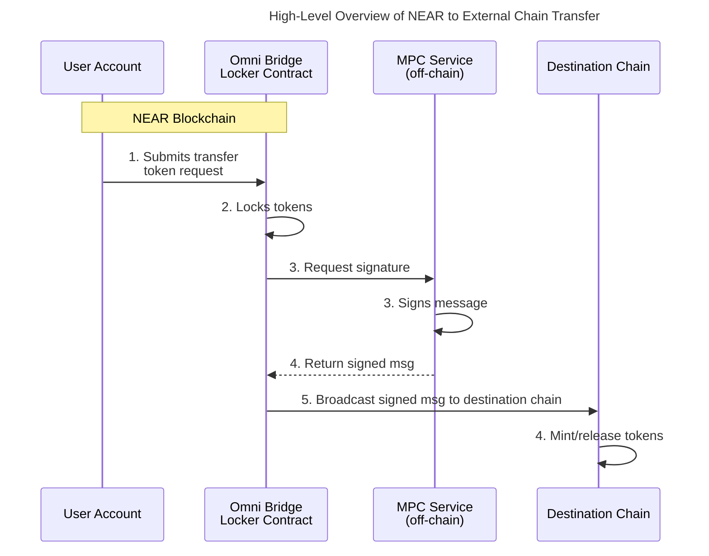

走向真正无需信任的跨链通信之路迈出了重要一步，当时 NEAR 团队[创建了与以太坊的首个无需信任桥](https://near.org/blog/the-rainbow-bridge-is-live)（Rainbow Bridge）。这一开创性成就证明了完全无需信任的跨链通信是可能的，标志着向链抽象愿景迈出了关键一步。然而，这种方法依赖于在以太坊上直接实现 NEAR 轻客户端——本质上需要以太坊理解并验证 NEAR 复杂的区块链规则。

Omni Bridge 使用链签名引入了一个更优雅的解决方案。它不在每个目标链上运行轻客户端，而是利用链签名的 MPC 服务在不产生轻客户端验证开销的情况下实现安全的跨链消息验证。这种新方法将验证时间从数小时缩短到数分钟，同时显著降低了所有支持链上的 Gas 成本。

### 轻客户端的问题

轻客户端是一种智能合约，允许一条区块链验证另一条区块链上发生的事件。就 Rainbow Bridge 而言，以太坊轻客户端需要跟踪 NEAR 的区块、验证其验证者的签名并确认交易。这带来了重大技术挑战：需要存储两周的以太坊区块数据，维护 NEAR 验证者及其质押的最新列表，最关键的是验证 NEAR 的 ED25519 签名——这是以太坊原本不支持的过程。这种验证计算成本高昂，使整个过程变得缓慢、昂贵，最终成为主要瓶颈。

例如，使用 Rainbow Bridge 时，由于 4 小时的挑战期和以太坊高 Gas 成本驱动的区块提交间隔，NEAR 到以太坊的交易需要 4 到 8 小时。更重要的是，当连接到多条链时，这种方法变得越来越不实际，因为每条链都需要其自己的轻客户端实现。某些链（如比特币）甚至不支持智能合约，使得实现 NEAR 轻客户端在技术上不可能。

虽然我们仍然需要在 NEAR 上支持不同网络的轻客户端（这更容易实现），但验证外部链上的 NEAR 状态需要不同的方法。

### 代币标准与跨链通信

在探索链签名如何解决这些问题之前，了解代币在 NEAR 上的工作方式非常重要。[NEP-141](https://github.com/near/NEPs/tree/master/neps/nep-0141.md)，NEAR 的可替换代币标准，有一个将其与以太坊 ERC-20 区分开来的关键特性：通过转移并调用功能实现内置的可组合性。

当在 NEAR 上使用 `ft_transfer_call` 进行代币转移时，代币合约首先转移代币，然后自动调用接收方合约上指定的 `ft_on_transfer` 方法。虽然这些操作在同一交易中按顺序发生，但接收方合约有能力拒绝转移，导致代币被退还。这种原子行为通过防止部分执行状态，确保了桥接操作的完整性和安全性。

有关更多信息，请参阅[可替换代币](../../primitives/ft/ft)。

## 进入链签名时代

链签名不是在目标链上维护复杂的轻客户端，而是基于三个核心组件引入了根本不同的方法：

1. **确定性地址衍生** - 每个 NEAR 账户都可以通过衍生路径在其他链上数学推导地址。这不仅仅是一种映射——而是一种密码学衍生，确保同一个 NEAR 账户始终控制所有支持链上的同一组地址。

2. **桥接智能合约** - NEAR 上的中心合约与 MPC 网络协调，为跨链交易生成安全签名。该合约处理代币锁定并为出站转移请求签名

3. **MPC 服务** - 一个去中心化节点网络，无需重建完整私钥即可联合签署交易。安全性来自阈值密码学——没有单个节点或小组节点能够单独创建有效签名。

## 综合运用

如我们所了解的，链签名从根本上改变了跨链消息的验证机制。在实践中，这意味着：

轻客户端方法需要目标链验证来自 NEAR 验证者的 ED25519 签名。链签名用单个 MPC 签名验证替代了这一过程。目标链只需使用其原生签名验证方案（EVM 链通常为 ECDSA）验证一个签名。

NEP-141 的交易保证处理代币锁定的安全性。转移在**单个交易**中创建两个操作：
1. 锁定代币并记录转移状态
2. 为目标链请求 MPC 签名

Locker 合约向 MPC 网络请求签名，MPC 网络随后为有效转移请求生成签名。这替代了挑战期的需求——安全性来自 MPC 阈值保证，而非乐观假设。

添加新链只需实现三个标准组件：
1. 链特定地址衍生
2. MPC 签名验证（或比特币等链的交易签名）
3. 桥接合约部署
4. 向 NEAR 转回的通信路径（目前对较新的链使用 Wormhole）

虽然我们仍然需要 NEAR 上的轻客户端来接收来自其他链的转移，但这种方法使支持更广泛的链成为可能，而无需在每个目标链上实现复杂的验证逻辑。

要开始使用 Omni Bridge 进行构建，请参阅：

- [Bridge SDK JS](https://github.com/near-one/bridge-sdk-js) JavaScript 版 Omni Bridge 实现
- [Bridge SDK Rust](https://github.com/near-one/bridge-sdk-rs) Rust 版 Omni Bridge 实现
