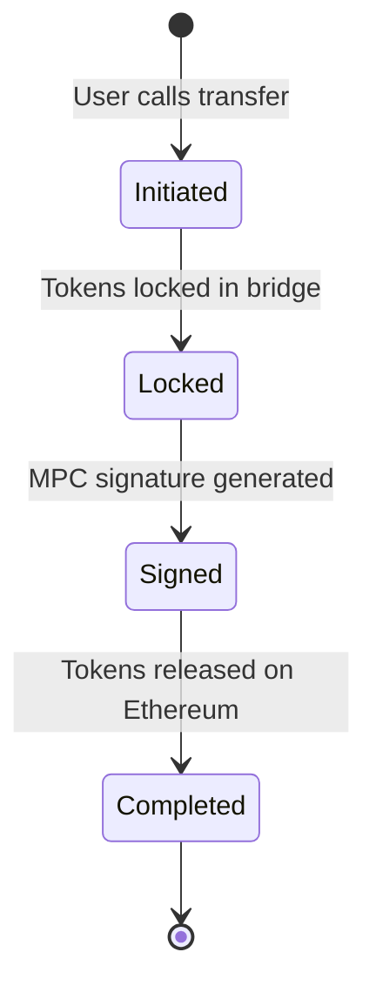
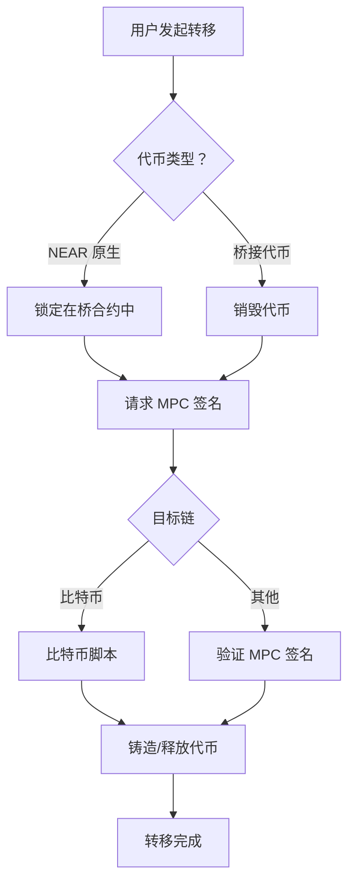

Omni Bridge 是一个复杂的跨链桥基础设施，能够在 NEAR 协议和各种其他区块链网络之间实现安全高效的代币转移。本文档对桥的架构提供详细的技术概述，涵盖其核心组件、安全模型和操作机制。通过利用多方计算（MPC）、链特定轻客户端和无许可中继器网络的组合，该桥在安全性、去中心化和用户体验之间实现了稳健的平衡。

有关参考代码实现，请参阅：

- [Bridge SDK JS](https://github.com/near-one/bridge-sdk-js) JavaScript 版 Omni Bridge 实现
- [Bridge SDK Rust](https://github.com/near-one/bridge-sdk-rs) Rust 版 Omni Bridge 实现

---

## 桥接代币工厂模式

Omni Bridge 的核心是 NEAR 上的桥接代币工厂合约，它既充当代币工厂又充当托管方。这个统一合约处理来自源链的原生代币和工厂本身创建的桥接代币。与拥有独立合约相比，这种设计简化了维护并降低了复杂性。

该合约有几项关键职责：

### 对于桥接代币（原本来自其他链的代币）：

* 首次桥接代币时部署新的代币合约
* 收到有效转移消息时铸造代币
* 发起向源链的转回时销毁代币

### 对于原生 NEAR 代币：

* 在转移期间作为托管方锁定代币
* 收到有效转移消息时释放代币
* 通过 NEP-141 标准管理代币操作

### 转移生命周期

转移的生命周期包括几个状态，以下显示的是原生 NEAR 代币从 NEAR 到以太坊的转移：

---

## 消息签名与验证

对于大多数链，桥使用基于有效载荷的消息签名系统（比特币是一个值得注意的例外，需要完整的交易签名）。

### 消息类型

桥支持几种类型的签名消息：

* **转移消息**
  * 发起消息
  * 完成消息
* **代币消息**
  * 部署消息
  * 元数据更新消息

### 有效载荷结构

消息使用 Borsh 序列化编码，包含：

| 组件 | 描述 |
|-----------|-------------|
| 消息类型 | 消息类别的标识符 |
| 链信息 | 链 ID 和相关地址 |
| 操作数据 | 金额、接收方、费用等 |

### 签名流程

1. NEAR 合约创建并存储消息有效载荷
2. MPC 网络观察者检测有效有效载荷
3. 节点联合签署有效载荷
4. 在目标链上验证签名

<Tip>
**主要优势**
* 通过结构化有效载荷使消息意图更清晰
* 在目标链上更高效地进行签名验证
* 跨链的标准化消息格式
</Tip>

## 交易流程：NEAR 到其他链

以下是从 NEAR 到不同目标链处理转移的概述：

### 转移流程

让我们跟踪当用户想要将代币从 NEAR 转移到另一条链时会发生什么：

#### 1. 发起

用户开始时调用代币合约，包含：

* 转移金额
* 目标链和地址
* 费用偏好（是否在被转移代币中支付费用还是用 NEAR 支付）
* 费用在 NEAR 侧为中继器铸造

#### 2. 代币锁定

代币合约将代币转移到 Locker 合约，该合约：

* 验证转移消息
* 分配唯一的随机数
* 记录待处理的转移
* 发出转移事件

#### 3. MPC 签名

桥合约：

* 请求生成签名
* MPC 节点联合生成和聚合签名
* 在整个过程中保持阈值安全性

#### 4. 目标链

目标链上的桥接代币工厂：

* 验证 MPC 签名
* 铸造等量代币

---

## 交易流程：其他链到 NEAR

反向流程根据源链有所不同：

### 1. 以太坊

使用 NEAR 轻客户端以获得最高安全性：

* 在源链上销毁代币
* 向 NEAR 提交证明
* 通过轻客户端验证证明
* 向接收方释放代币

### 2. 支持的非 EVM 链（如 Solana）

利用既有的消息传递协议（如 Wormhole）用于：

* 链间消息传递
* 交易验证
* 与 NEAR 代币工厂系统集成

### 3. 其他 EVM 链

利用轻客户端（效率高时）和消息传递协议的组合，确保对入站转移的安全验证。

---

## 交易流程：链到链（通过 NEAR）

对于两条非 NEAR 链之间的转移（如以太坊到 Solana），桥将两种流程结合起来，以 NEAR 作为中间路由层。桥不是在 NEAR 上铸造或解锁代币，而是创建一条转发消息，指示代币在最终目标链上铸造或解锁。

从用户的角度来看，这表现为单一操作——他们在源链上发起转移，链下中继器基础设施自动处理中间 NEAR 路由。

---

## 安全模型

### 信任假设

Omni Bridge 根据链连接方式需要不同的信任假设：

#### 对于链签名：

* NEAR 协议安全性（2/3 以上诚实验证者）
* MPC 网络安全性（2/3 以上诚实节点）
* 没有单一实体控制足够多的 MPC 节点来伪造签名
* 签名协议的正确实现

#### 对于以太坊/比特币连接：

* 轻客户端安全性
* 最终性假设（如足够的区块确认）
* 链特定的共识假设

#### 对于消息传递连接：

* 底层消息传递协议的安全性（如 Wormhole 守护者网络）
* 由 NEAR 网络参与者（如验证者和全节点）验证

---

## 中继器网络

中继器是无许可基础设施运营商，监控桥接事件并执行跨链交易。与许多桥设计不同，我们的中继器不能：

* 伪造转移
* 窃取资金
* 审查交易（用户可以自行中继）
* 为了利润抢先交易
* 不产生额外的安全假设

<Info>
中继器的角色纯粹是操作性的——执行有效的转移并收取预定费用。多个中继器可以同时运行，为更快的执行速度和更低的费用创造竞争。
</Info>

---

## 快速转移

标准跨链转移可能由于最终性和验证要求而耗时较长。**快速转移**允许中继器通过提前提供流动性来加快这一过程。

### 工作原理

1.  **用户发起：** 用户发送一条 `FastFinTransferMsg`，指定目的地和费用。
2.  **中继器执行：** 中继器检测到请求，立即从自己的资金中向用户在目标链上转移等额金额（扣除费用）。
3.  **结算：** 一旦原始转移完全验证和最终确认，桥后续偿还中继器。

<Tip>
快速转移非常适合优先考虑速度而非成本的用户，因为中继器可能会为流动性和便利性收取溢价。
</Tip>

---

## 多代币支持（ERC1155）

Omni Bridge 支持 **ERC1155** 标准，能够在单个合约内转移多种代币类型。

### 地址衍生
为了保持跨链一致性，桥接的 ERC1155 代币使用确定性地址衍生方案：
*   **确定性地址：** `keccak256(tokenAddress + tokenId)`
*   这确保 ERC1155 合约中的每个 `tokenId` 在目标链上映射到唯一的一致地址。

### 关键函数
*   **`initTransfer1155`**：为特定 ERC1155 代币 ID 发起转移。
*   **`logMetadata1155`**：注册特定代币 ID 的元数据，确保索引器和钱包能够识别它。

---

## 费用结构

桥接费用在 NEAR 上统一处理，包含以下组成部分：

### 执行费用

* 目标链 Gas 成本
* 源链存储成本
* 中继器运营成本
* MPC 签名成本

### 费用支付选项

* 源链原生代币
* 被转移的代币

<Note>
费用根据不同链上的 Gas 价格动态调整，以确保可靠执行。
</Note>

### 设计目标

费用结构旨在：

* 确保中继器的经济可行性
* 防止经济攻击
* 允许费用市场竞争
* 覆盖最坏情况下的执行成本

<Tip>
用户可以通过自行执行转移完全绕过中继器，只需支付每条链上必要的 Gas 费用。这为中继器费用创造了自然上限。
</Tip>
