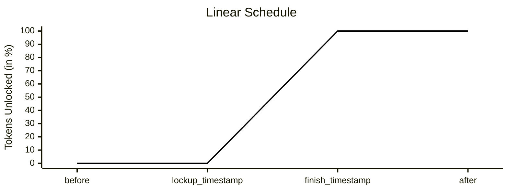
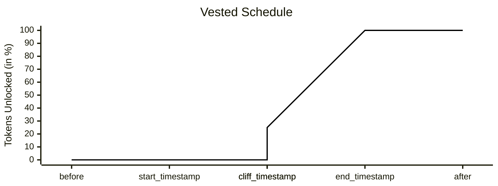
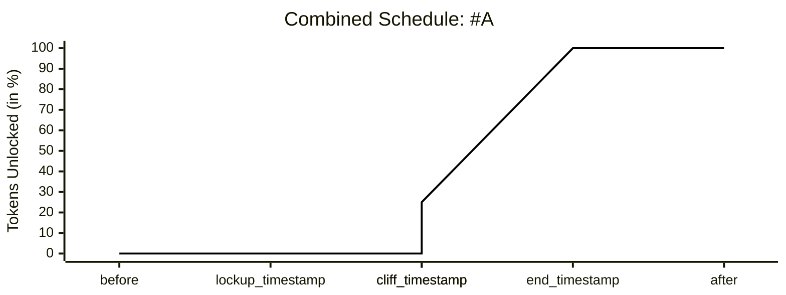
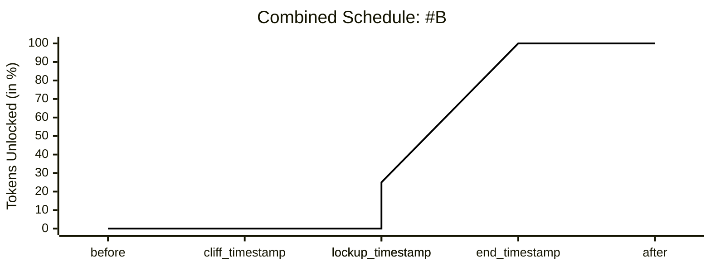

锁定合约充当托管账户，持有代币并随时间逐步释放。它们被广泛用于管理员工薪酬、投资者归属计划或长期代币分配。

锁定合约通过结合两个关键机制来限制代币流动性，直到满足预定义条件：

- **锁定期（Lockup）** – 代币在特定日期到达之前保持锁定状态。
- **归属期（Vesting）** – 代币可供用户使用，但可能会逐步释放。

通过锁定期和归属期，项目可以强制执行可预测的代币释放计划，使激励措施保持一致并提高透明度。

---

## 锁定计划

锁定期定义了代币如何随时间线性释放，由以下参数描述：

- `lockup_timestamp` – 解锁开始的时间。
- `release_duration` – 解锁持续的时间。  
  到期时，所有代币均可使用。
- `finish_timestamp = lockup_timestamp + release_duration`

---

## 归属计划

归属期增加了额外条件，通常用于就业或投资协议：

- `start_timestamp` – 归属开始的时间（例如入职日期）。
- `cliff_timestamp` – 首次代币归属的时间（例如 1 年）。
- `end_timestamp` – 归属完成的时间。

示例：
**4 年归属期**配合 **1 年悬崖期**意味着：

- 第 1 年：没有代币归属。
- 满 1 年时：一次性归属 25%。
- 剩余 75% 在接下来的 3 年内线性归属。

---

## 组合计划

锁定期和归属期可以组合使用。代币只有在两个条件都满足时才具有流动性：

`liquidity_timestamp = max(lockup_timestamp, cliff_timestamp)`

根据哪个事件先发生，代币释放的结果有所不同。

### 情景 A：锁定期早于悬崖期

在这种情况下，锁定时间戳早于悬崖时间戳。虽然锁定计划通常允许代币开始解锁，但归属悬崖期尚未到来。因此，在悬崖期到来之前，没有代币具有流动性。

这引入了三个关键时间戳：

- `lockup_timestamp` – 早于归属悬崖期
- `cliff_timestamp` – 较晚到来，因此归属期延迟了流动性
- `end_timestamp` – 归属完全完成的时间

### 情景 B：悬崖期早于锁定期

在这种情况下，到达悬崖期时，25% 的代币被视为已归属。但由于锁定期尚未结束，流动性仍然受阻。

这引入了三个关键时间戳：

- `cliff_timestamp` – 早于锁定期
- `lockup_timestamp` – 较晚到来，延迟了流动性解锁
- `end_timestamp` – 归属完全完成的时间

---

## 基金会终止

当初始化时指定了 `foundation_account_id` 时，该账户被授予在自然完成之前终止归属的权利。终止的效果取决于终止发生在归属悬崖期之前还是之后。

- 如果终止发生在悬崖期日期之前，则没有代币被视为已归属，整个分配将退还给基金会。

- 如果终止发生在悬崖期之后，则到目前为止已归属的部分留给所有者，而所有剩余未归属代币将返还给基金会。

这确保了所有者不会收到超过已归属部分的代币，同时给予基金会一种在协议提前终止时收回锁定部分的机制。

您将在继续阅读时发现实际示例。

---

## 使用锁定代币质押

锁定合约允许所有者将代币委托给白名单质押池，让所有者在基础代币保持锁定状态的同时赚取额外奖励。

其工作流程如下：

- 所有者从白名单中选择一个验证节点，并通过锁定合约质押代币。

- 质押金额本身仍受锁定期和归属计划的约束保持锁定。

- 验证节点随时间产生质押奖励。

一个关键区别是质押奖励是立即具有流动性的。它们不受原始锁定期或归属条件的约束。例如，如果锁定并质押了 1000 NEAR 一个月，并赚取了 10 NEAR 作为奖励，当所有者决定解除质押时，原始的 1000 NEAR 遵循正常的锁定期和归属限制，而任何已赚取的奖励可以直接转移到您的账户。
